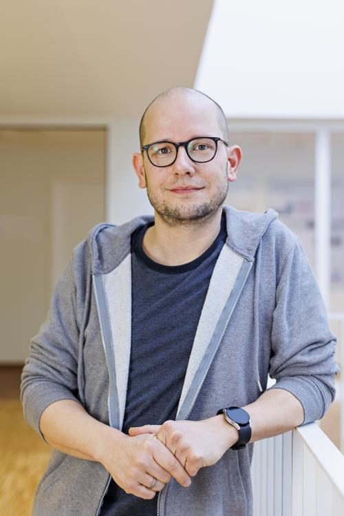
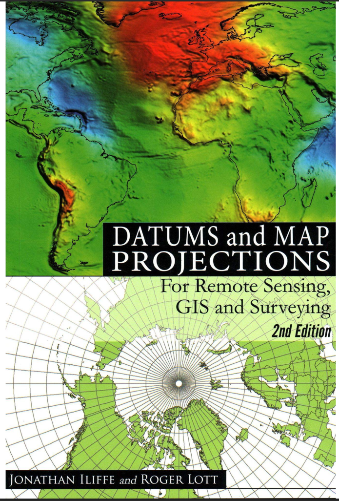
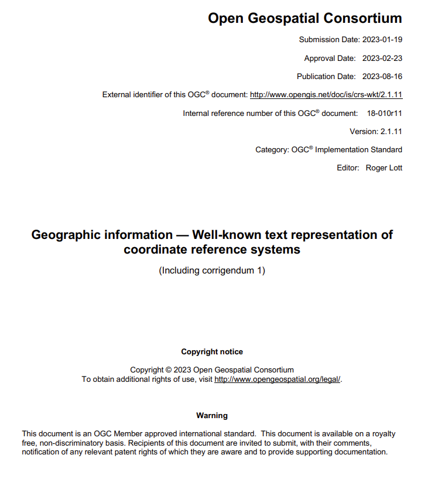
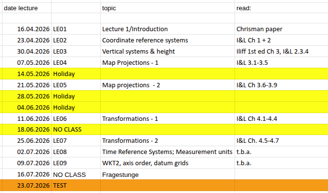
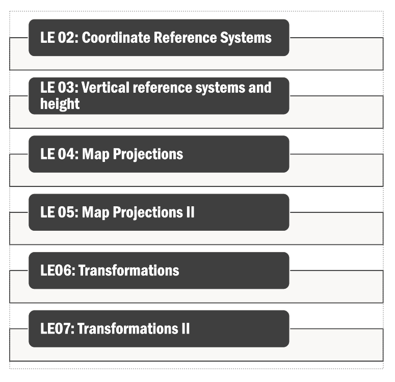
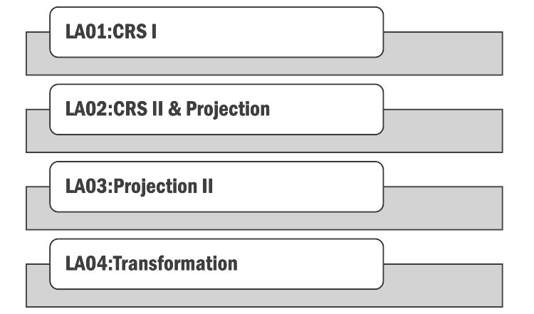
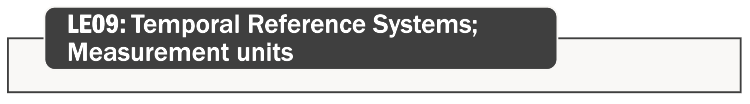
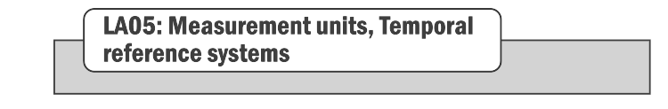

## Teachers

::::: columns
::: {.column width="50%"}
Poshan Niraula (Lecture)

{width="250"}
:::

::: {.column width="50%"}
Christian Knoth (Lab)

{width="250"}
:::
:::::

## Course format

-   Each participant studies the course materials **by themselves in-depth**, core conepts will be revisited in lecture and discussions

-   Ask 1 or 2 question (related to the lecture) to be discussed in the class

    -   [No questions from you means **everything** is understood]{.smaller}

    -   [No question from you means **less content** for lecture]{.smaller}

    -   [The more questions we have, the more we all learn]{.smaller}

    -   [Questions may concern **understanding**, or bring up a **discussion**]{.smaller}

-   Labs repeat and complement the discussion in class, and help understand the theory by using it in practice

## Course format- why

-   Lecture + Flipped classroom style

-   The idea is to read at your own pace, by yourself, and to discuss in group setting

## Lecture format ..

-   Thursdays (Check schedules)

-   10:00 = 10:15 up until \~12:00

<!-- -->

-   Discussion

-   Overview of next week's reading (short lecture)

## Labs

12:00 = 12:15 up until \~14:00

-   Schedule of labs: will be distributed in lab class today

-   5 labs in total

-   2 weeks time to work on them **independently**

-   Lab slots for Thursdays are intended to provide assistance

-   Submission deadline - Christian will communicate later today

## Workload

-   5 CP, 12 weeks (this week included)

-   5\*30/12 ≈ 12.5 - 3 = 9.5 hours per week

-   Note that this would sum to a study load of 60 hrs /week; since most of the work here concerns reading, **consider doing most of it during the first half of the semester.** The second half will be more demanding for all other courses.

## Participation

Join the course in Learnweb

Questions for the Thursday lecture should be uploaded by Wednesday, noon

## Grading

-   Labs: Pass/Fail

-   Exam: 100% [**on July 23, 2026**]{.underline}

    -   Entry to exams: [**at least 3 labs passed by July 10, 2026**]{.underline}

-   Discussions: Bonus points for active participation

## Materials

{width="555"}

## WKT2

<https://docs.ogc.org/is/18-010r11/18-010r11.pdf>

## Course Schedule

See this [link](https://docs.google.com/spreadsheets/d/1Dpp5IvPdphURkZ5eiKj4QL6YtOiuTJSYao2KQ091-90/edit?usp=sharing)

Course contents could change slightly

## Part I: Spatial Reference Systems

::::: columns
::: {.column width="50%"}

:::

::: {.column width="50%"}

:::
:::::

## Part II: Temporal and Measurement Scale

::::: columns
::: {.column width="50%"}

:::

::: {.column width="50%"}

:::
:::::