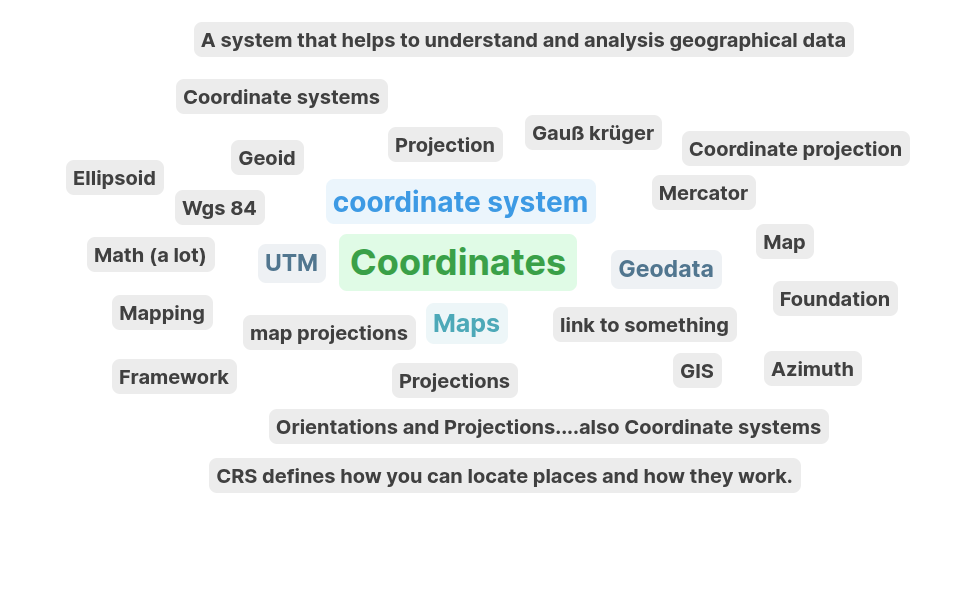
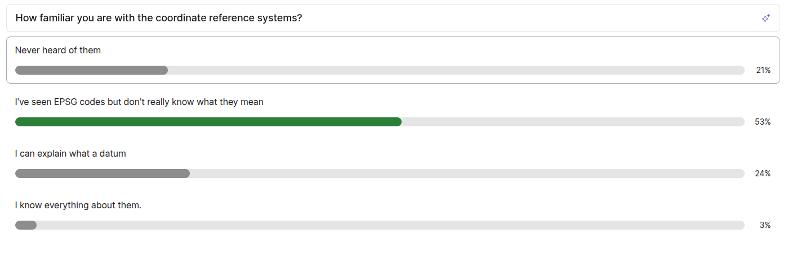
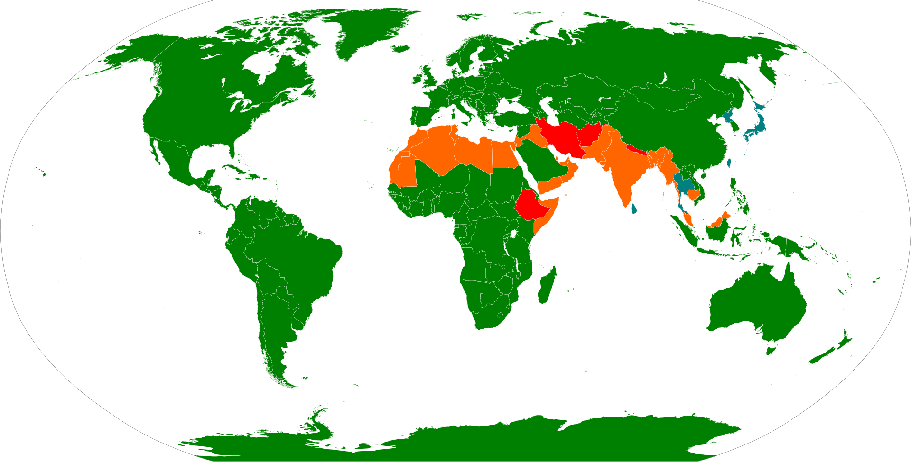
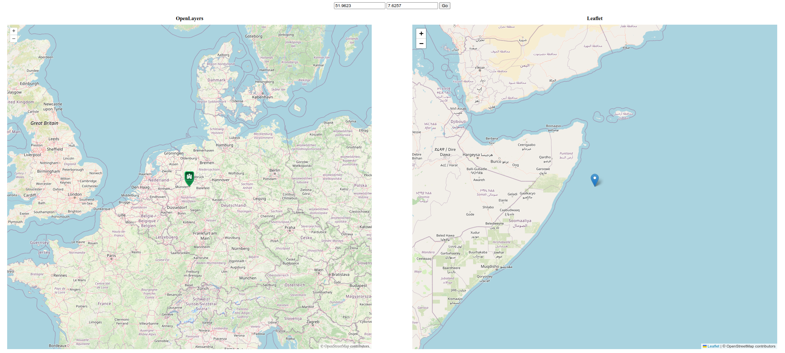
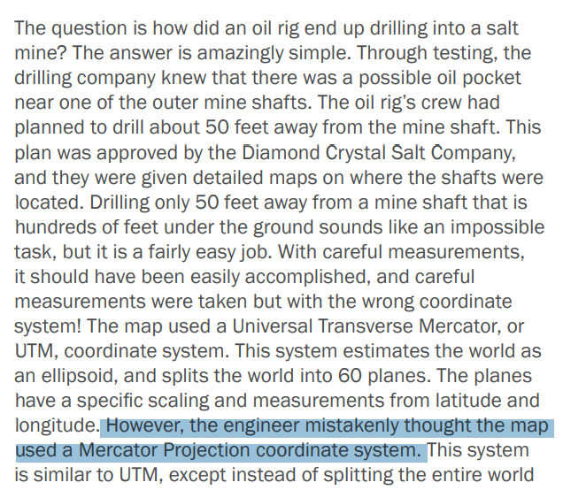
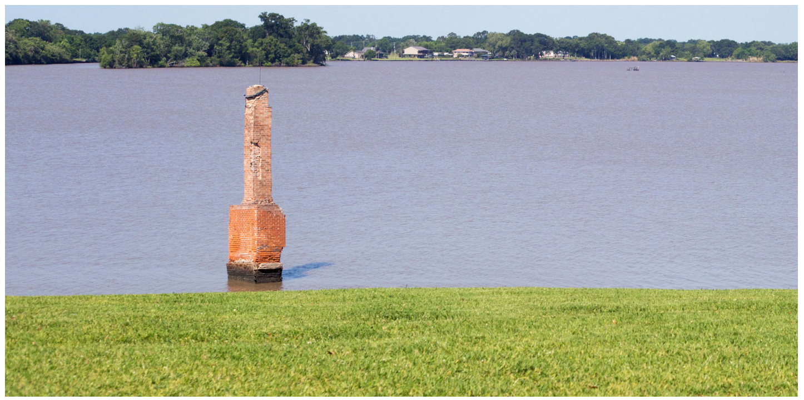
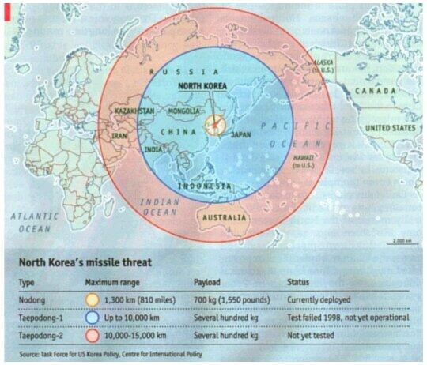
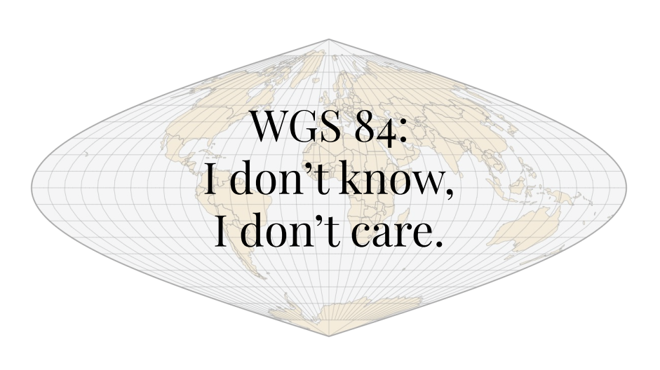
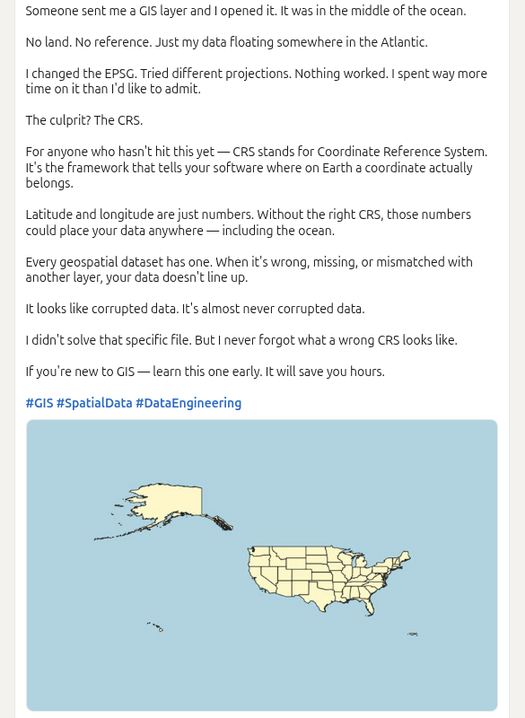
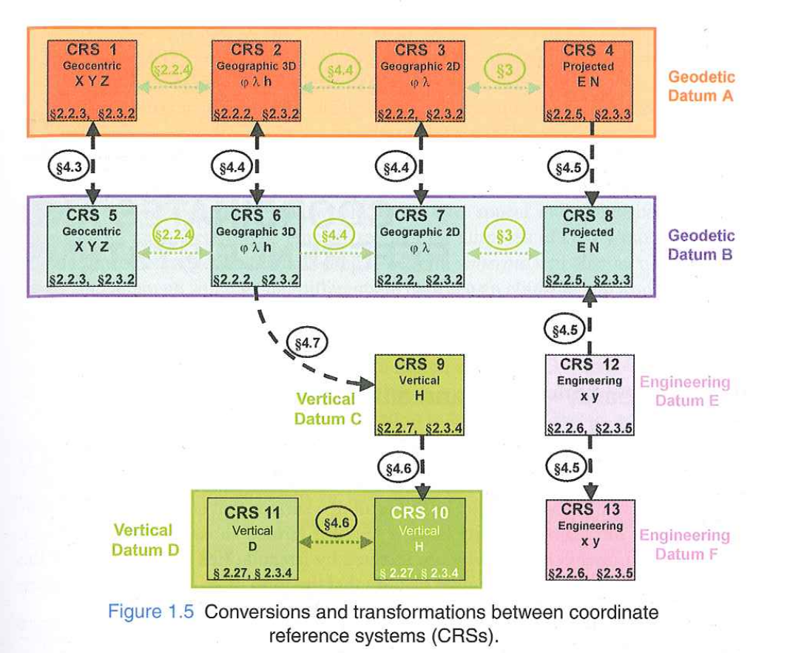

## Overview

1.  Slido
2.  Learning objectives of the course
3.  Fundamentals
4.  Where/why we need reference systems?
5.  Book chapters organization
6.  Up next

## 1. Share your thoughts {.center}

What comes to your mind, when you hear "Coordinate reference system"?

## 1. Share your thoughts again {.center}

## 2. Learning objectives {.smaller}

By the end of the course you will be able to:

::: incremental
1.  **Identify, interpret, and critically evaluate** coordinate reference system information in geospatial data and software

2.  **Select and apply** appropriate projections, datums, and transformations for a given task

3.  **Diagnose and fix** reference system problems when combining, transforming, or sharing spatial data
:::

## 2. Learning objectives ... {.smaller}

And along the way, you'll be able to explain:

-   Why **Africa** looks the same size as **Greenland** on many world maps — even though it is **14 times larger** -\> True size

-   Why Google Maps uses a projection that **is mathematically wrong** — and why they chose it anyway

-   Why many world maps show **Antarctica as an infinitely wide strip** at the bottom — or simply **cut it off**

-   Why your phone's GPS might say you're at **8820 m elevation** while the official sign at the summit says **8848 m** — and **both are correct**

## 3. Fundamentals {.center}

## Geographic Information- three components

-   Where, When and What

-   Space, Time and Attribute

-   [Münster]{style="color:green;"}, [9am 09.04.2025]{style="color:#FF957E;"}, [Temperature -1**°**C]{style="color:#4253AD;"}

## Space representation

-   Space as Coordinates

    \[[51.968°, 7.665°, 62m]{style="color:green;font-weight:bold;"}, 9am, 09.04.2025, Temperature -1**°**C\]

-   Space as place name

    \[[Münster]{style="color:green;font-weight:bold"}, 9am 09.04.2025, Temperature -1**°**C\]

-   Space as a spatial description

    \[[64Km west of Bielfeld]{style="color:green;font-weight:bold"}, 9am 09.04.2025, Temperature -1**°**C\]

## Coordinates are values in a reference system

-   [51.968849°,7.6650811°, 62m]{style="color:green;"}

-   51.968849° degrees East from Longitude 0 (Greenwich)

-   7.6650811° degrees North from Latitude 0 (Equator)

-   62m above the sea level

-   Without the [reference(Greenwich, Equator, Sea level,..)]{.highlight} the coordinates are meaningless

## Temporal descriptions are values in a reference system

:::: columns
::: {.column width="50%\""}
-   Time as a time stamp [09.04.2025 09:00:00]{style="color:#FF957E;font-size:0.7em;"}

-   Universally? accepted system

-   

    -   UTC
    -   [Gregorian Calendar]{.highlight} [https://en.wikipedia.org/wiki/Gregorian_calendar]{style="font-size:0.7em;"}
    -   [No. of seconds since 01.01.1970 - Epoch time 09.04.2025 10:02:00 GMT **= 1744192974**]{style="font-size:0.7em;"}
:::
::::

## Attribute representation

::::: columns
::: {.column width="50%"}
[Temperature, -1**°**C]{style="color:#4253AD;"}
:::

::: {.column width="50%"}
{width="234"}
:::
:::::

## Summary: Reference systems-definition

-   Key features of any reference system are:

    -   Origin

    -   Orientation

    -   Unit of Measurement

## Summary

-   Values are not meaningful by themselves, their [accurate interpretation]{.highlight} necessitates knowledge of the reference system(s)

-   Put differently: without a documentation of the reference systems, [ambiguity]{.highlight} is guaranteed

-   [Conversion]{.highlight} between values in different reference systems is often desirable, sometimes possible without information loss, sometimes not

-   Reference systems are [not absolute]{.highlight}, they are created (and live by) conventions

## 4. Where/why we need reference systems? {.center}

## Web mapping

-   \[[51.9623, 7.6257]{style="color:green;"}\]

## Positioning

-   GPS uses World Geodetic System 1984 (WGS 84)

-   GLONASS uses Parametry Zemli (PZ-90)

-   Galileo uses Galile Terestrial Reference Frame (GTRF)

-   Beidou uses China Terrestrial Reference Frame (CGCS 2000)

-   [https://gssc.esa.int/navipedia/index.php/Reference_Frames_in_GNSS]{style="font-size:0.7em;"}

-   [Which of these system does your smart phone use?]{.highlight}

## Positioning

## Combining data from different sources

-   [**Engineering Oops: The Maelstrom of Lake Peigneur**](https://digitalcommons.latech.edu/cgi/viewcontent.cgi?article=1036&context=engineering-science-magazine)

    ::::: columns
    ::: {.column width="40%"}
    
    :::

    ::: {.column width="60%"}
    {width="920"}
    :::
    :::::

## Is earth flat??

-   The concentric circles map was created by the Economist

    ::::: columns
    ::: {.column width="60%"}
    
    :::

    ::: {.column width="40%"}

    :::
    :::::

## Look at more examples here ..

[**Javier Jimenez Shaw**]{.highlight}: [WGS 84: I don't Know I don't care](https://javier.jimenezshaw.com/data/WGS_84_I_dont_know_I_dont_care.pdf)

## Has this ever happened to you?

## Summary

-   Reference systems [often go unnoticed]{.highlight}, yet they are crucial to our interaction with spatio-temporal information
-   Three important questions:
    -   How to document reference system information?
    -   How to find out reference system information when it is not "there"?
    -   How to convert values from one reference system to another?

## 5. About the Book {.center}

## 6. Up Next {.center}

## For the next lecture

-   Read chapters 1 and 2 of the course book (up to Sec. 2.3.3, page 29)
-   Answer (for yourself) the following questions:
    -   [Why is a geographic dataset without coordinate system information ambiguous?]{.small}
    -   [What is a equipotential surface?]{.small}
    -   [Name one similarity and two differences between latitude and longitude]{.small}
    -   [Name four types of datums and their differences]{.small}
    -   [Name one similarity and two differences between WGS84 and ITRF]{.small}
-   Submit your questions to Learnweb by Wednesday [noon]{.highlight} next week (22.04.2026 12:00:00) {.smaller}