# The Shape of the Earth {background-color="#1a1a2e" style="color: white;"}

---

## The Earth is not a mathematical shape

The physical surface of the Earth is irregular — mountains, valleys, ocean trenches.

We cannot define coordinates directly on this surface.

We need a **simpler model**.

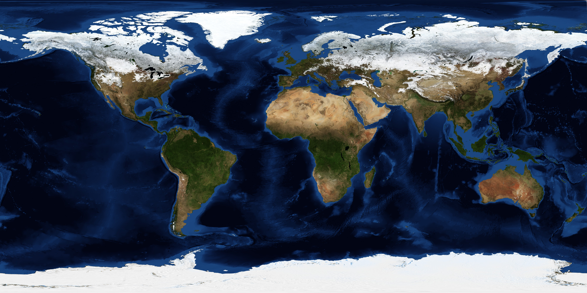{fig-align="center" width="700"}

[Source: https://science.nasa.gov/earth/earth-observatory/blue-marble-next-generation/]{.small}

---

## First approximation — the Geoid

The **geoid** is the shape the ocean would take under gravity alone — no currents, no wind, no temperature differences.

- An **equipotential surface** of Earth's gravity field
- Irregular — deviates from a smooth shape by ±100 m
- Good for defining **heights**, too complex for defining **coordinates**

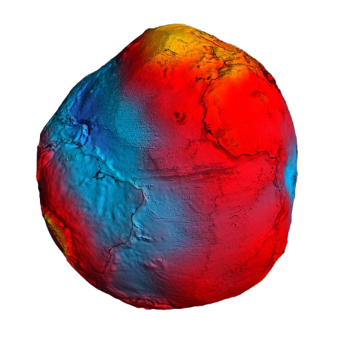{fig-align="center" width="600"}

[Source: https://www.esa.int/ESA_Multimedia/Images/2011/03/New_GOCE_geoid]{.small}

---

## Second approximation — the Ellipsoid

An **ellipsoid** (oblate spheroid) — defined by just two parameters.

- Semi-major axis $a$ (equatorial radius)
- Inverse flattening $1/f$

Smooth, mathematically simple, good enough for horizontal coordinates.

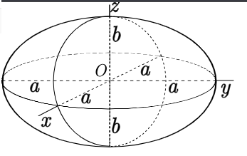{fig-align="center" width="500"}

[Source: Wikipedia commons]{.small}

---

## Three surfaces — summary

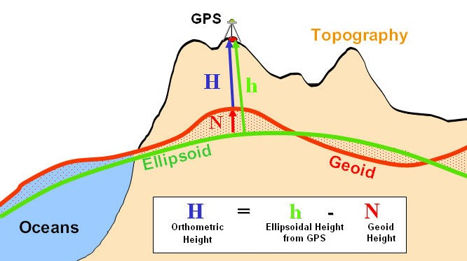{fig-align="center" width="800"}

[Source: https://link.springer.com/article/10.1007/s12517-024-11884-w?fromPaywallRec=true#Fig1]{.small}

 - Physical surface => Real, irregular 
 - Geoid => Gravity-based, bumpy; used for Height reference 
 - Ellipsoid => Mathematical, smooth; Horizontal coordinates 

# Coordinate Systems {background-color="#1a1a2e" style="color: white;"}

---

## What is a coordinate system?

A set of rules for assigning **numbers to points**.

Purely **abstract** — no connection to the Earth yet.

---

## Attributes of a coordinate system

Every coordinate system defines:

- **Number of axes** — 2 or 3
- **Axis names** — latitude, longitude, easting, X, Y, Z ...
- **Axis directions** — north, east, up ...
- **Axis units** — degrees, metres, feet ...
- **Axis order** — which comes first?

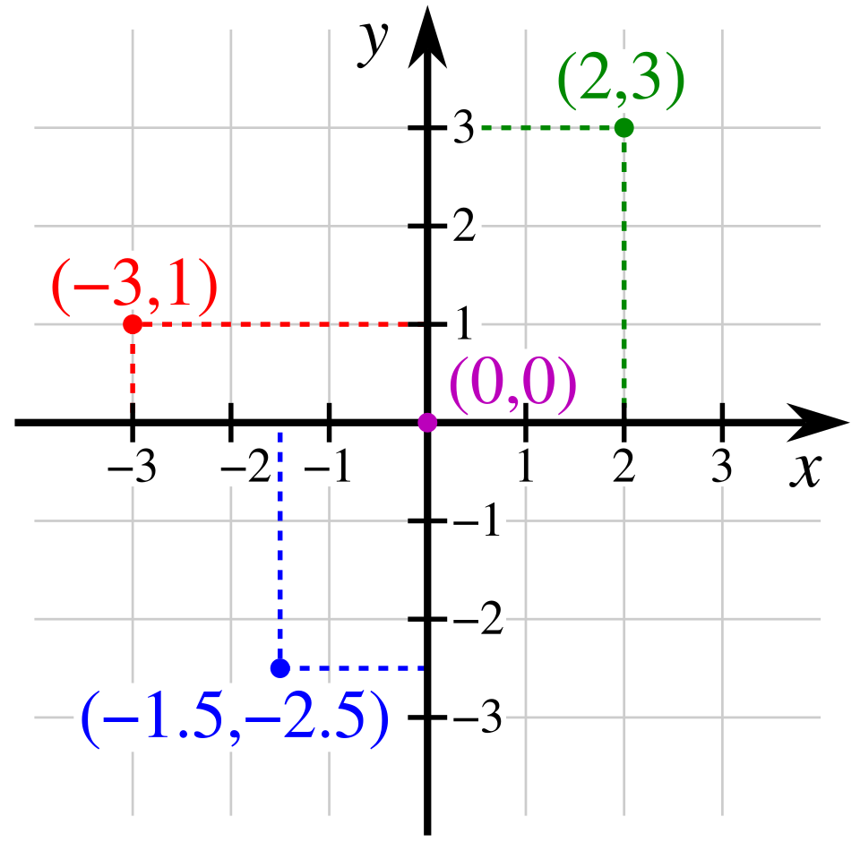{fig-align="center" width="400"}

---

## Many coordinate systems exist

The same point on Earth can be described using different coordinate systems.

We now look at the main types.

---

## Coordinates on a sphere

On a sphere, position is defined by two angles:

- **Latitude** $\varphi$ — angle from the equatorial plane to a line to the centre
- **Longitude** $\lambda$ — angle from the prime meridian

On a sphere, the surface normal passes through the centre — latitude has only one definition.

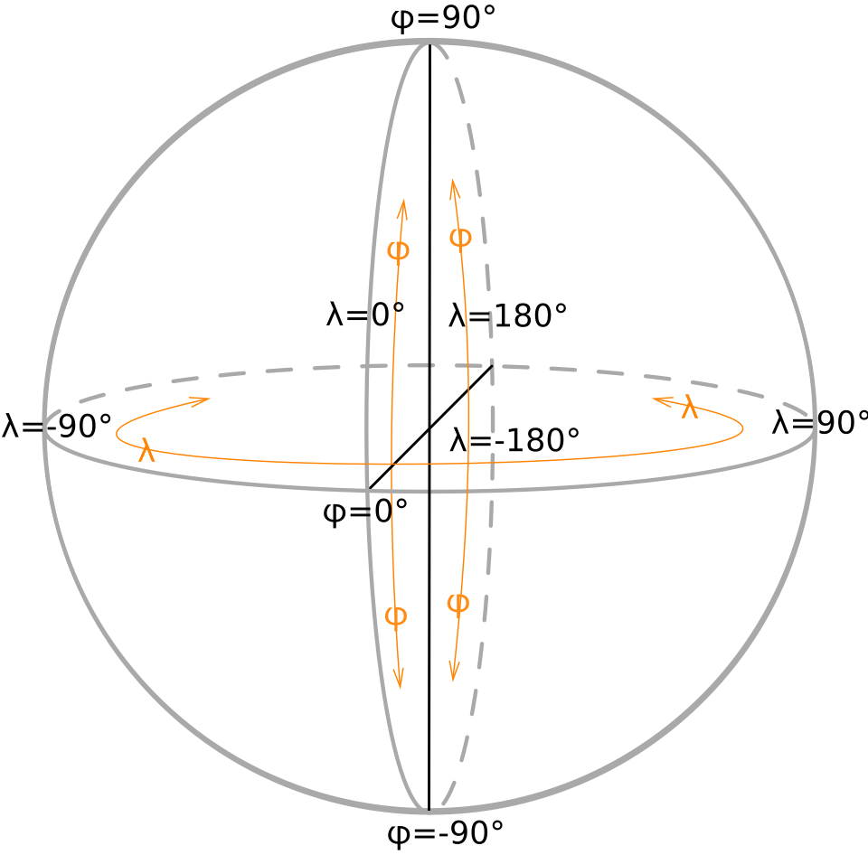{fig-align="center" width="450"}

[Source: Wikipedia commons]{.small}

---

## Coordinates on an ellipsoid

On an ellipsoid, the surface normal **does not** pass through the centre.

This creates two different definitions of latitude:

- **Geodetic latitude** — angle of the surface normal to the equatorial plane
- **Geocentric latitude** — angle of the line to the centre to the equatorial plane

They differ by up to ~11.5 arc-minutes (~21 km) at 45°.

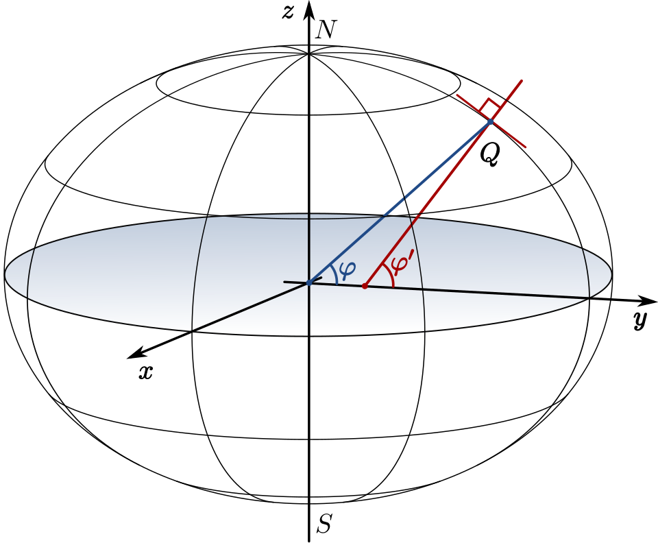{fig-align="center" width="500"}

[Source: Wikipedia commons]{.small}

---

## Ellipsoidal coordinate system

| Coordinate | Symbol | Range |
|-----------|--------|-------|
| Geodetic latitude | $\varphi$ | −90° to +90° |
| Geodetic longitude | $\lambda$ | −180° to +180° |
| Ellipsoidal height | $h$ | metres above ellipsoid |

- 2D version: $(\varphi, \lambda)$
- 3D version: $(\varphi, \lambda, h)$

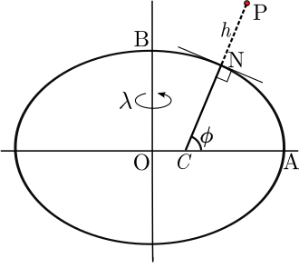{fig-align="center" width="450"}

[Source: Wikipedia commons]{.small}

---

## Geocentric Cartesian system

Origin at Earth's **centre of mass**. Three straight-line axes.

| Axis | Points toward |
|------|--------------|
| X | Equator ∩ Prime Meridian |
| Y | Equator ∩ 90°E |
| Z | North Pole |

Units: metres. No ellipsoid needed.

Used in GNSS processing and satellite geodesy.

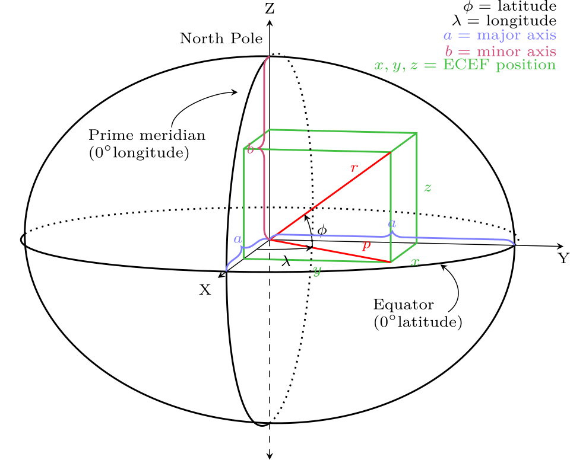{fig-align="center" width="450"}

[Source: Wikipedia commons]{.small}

---

## Conversion between ellipsoidal and geocentric

These describe the **same point** — conversion is **exact**.

**Ellipsoidal → Geocentric:**
Section 2.2.4 has conversion formulas

---

## Projected coordinate systems

Convert curved $(\varphi, \lambda)$ to flat $(E, N)$ — Easting and Northing.

- Units: metres
- Enables flat maps, distance/area calculations on a plane
- Always introduces **distortion** (shape, area, distance, or direction)

We cover projections in detail in Lectures 4 and 5.

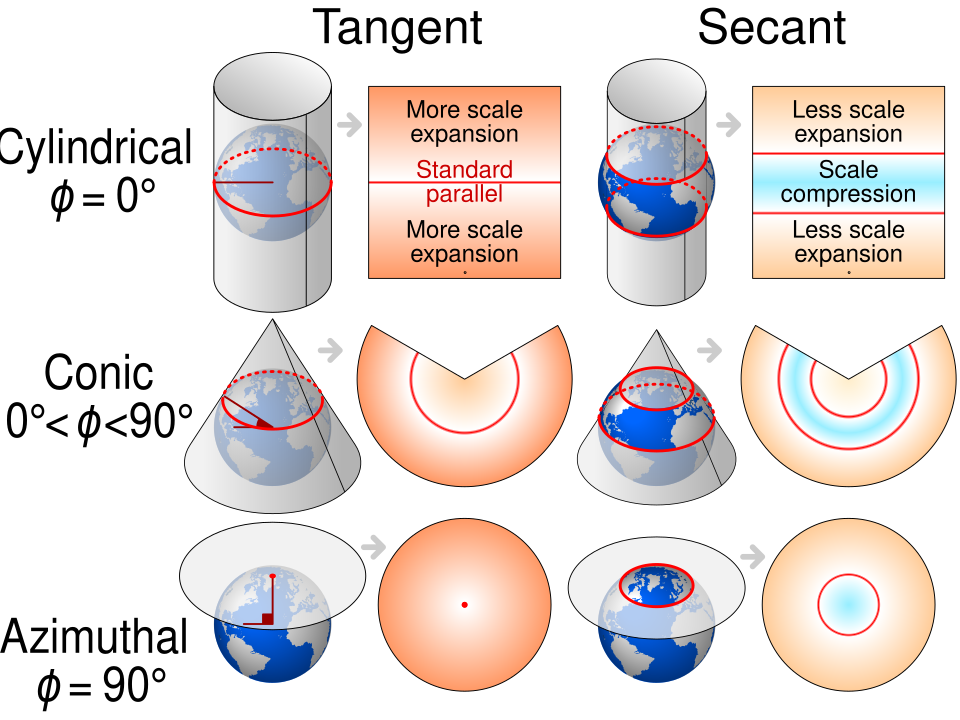{fig-align="center" width="600"}

[Source: Wikimedia commons]{.small}

---

## Local engineering coordinate systems

For small areas — construction sites, buildings, bridges.

- Origin at a convenient local point
- Axes: typically East, North, Up
- Earth's curvature ignored (area small enough)
- Units: metres

Must be connected to a global CRS to integrate with other data.

<!-- {fig-align="center" width="500"} -->

---

## Gravity-Related Height Systems

GPS gives **ellipsoidal height** $h$ — height above the ellipsoid.

We usually want **orthometric height** $H$ — height above the geoid ("sea level").

$$h = H + N$$

where $N$ is the **geoid undulation** (geoid height above/below the ellipsoid).

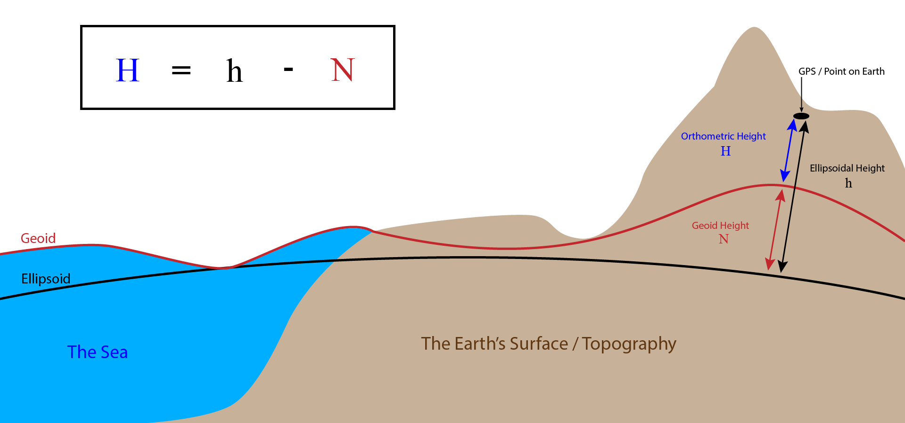{fig-align="center" width="600"}

---

# Datums {background-color="#1a1a2e" style="color: white;"}

---

## What is a datum?

A coordinate system is abstract — floating in mathematical space.

A **datum** anchors it to the **real Earth**.

It defines:

- **Where** the origin is
- **How** the axes are oriented
- **What scale** is used

---

## Without a datum

Same coordinate system, no anchor → coordinates are meaningless.

With a datum → every number refers to a specific place on Earth.

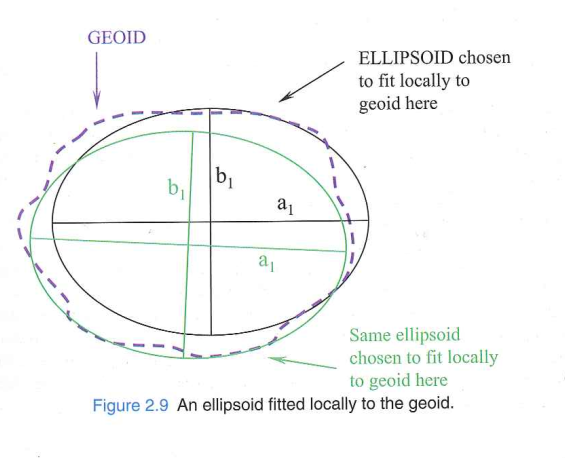{fig-align="center" width="600"}

[Source: Iliffe, Jonathan , and Roger Lott . 2008. Datums and Map Projections for Remote Sensing, GIS,
and Surveying. Whittles Pub. CRC Press, Scotland, UK.]{.small}

---

## Geodetic datum

A **geodetic datum** specifically anchors an ellipsoid to the Earth for defining latitude and longitude.

Two ingredients:

1. **Which ellipsoid** (shape and size)
2. **How it is positioned and oriented** relative to the Earth

---

## Before satellites — local datums
Steps to realise a local datum:

1. **Choose an ellipsoid** that fits your region well (e.g., Bessel 1841)
2. **Pick a fundamental point** on the surface (e.g., Rauenberg, Germany)
3. **Align the ellipsoid** so its normal matches gravity direction at that point
4. **Orient** the minor axis parallel to Earth's rotation axis
5. **Survey outward** from the fundamental point to build a network

---

## Local datums — the result

- Fits well **near the fundamental point**
- Gets worse **further away**
- Every country built their own → many datums worldwide

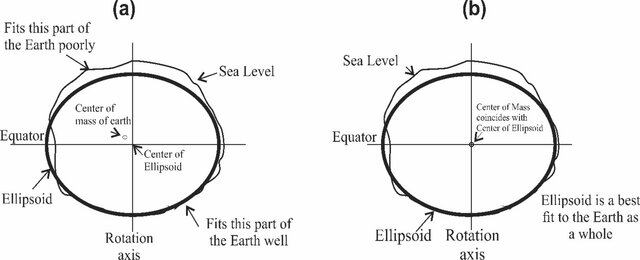{fig-align="center" width="700"}

[Source: Kalu, I., Ndehedehe, C. E., Okwuashi, O., & Eyoh, A. E. (2022). A comparison of existing transformation models to improve coordinate conversion between geodetic reference frames in Nigeria. Modeling Earth Systems and Environment, 8(1), 611-624.]{.small}

---

## After satellites — geocentric datums

Satellites see the **whole Earth** → we can locate the centre of mass.

Steps to realise a geocentric datum:

1. Define the origin (centre of mass), axis directions, and scale
2. Observe from a global network using VLBI, SLR, GNSS, DORIS
3. Compute station coordinates as (X, Y, Z) in a consistent global frame
4. Assign velocities to account for plate tectonics
5. Optionally associate an ellipsoid (e.g., GRS 80) when users want lat/lon

Result: consistent worldwide, no regional bias.

---

## Many ellipsoids, many datums

| Datum | Ellipsoid | Type | Region |
|-------|-----------|------|--------|
| DHDN | Bessel 1841 | Local | Germany |
| ED50 | International 1924 | Local | Europe |
| NAD27 | Clarke 1866 | Local | North America |
| NAD83 | GRS 80 | Geocentric | North America |
| ETRS89 | GRS 80 | Geocentric | Europe |
| WGS 84 | WGS 84 | Geocentric | Global |

# Coordinate Reference Systems {background-color="#1a1a2e" style="color: white;"}

---

## CRS = Coordinate System + Datum

$$\boxed{\text{CRS} = \text{Coordinate System} + \text{Datum}}$$

The coordinate system defines **how numbers work**.

The datum defines **where they point**.

Together: unambiguous positions on Earth.

---

## Same coordinate system, different datums

All use ellipsoidal coordinates (latitude °, longitude °) — but different anchors.

| CRS | Datum | EPSG |
|-----|-------|------|
| WGS 84 geographic | WGS 84 | 4326 |
| ETRS89 geographic | ETRS89 | 4258 |
| ED50 geographic | ED50 | 4230 |

Münster in each:

| CRS | Latitude | Longitude |
|-----|----------|-----------|
| WGS 84 | 51.96885° | 7.66508° |
| ED50 | 51.96961° | 7.666295° |

Same point. Different numbers. Different datum.

---

## Same datum, different coordinate systems

All anchored to WGS 84 — but numbers assigned differently.

| CRS | Coord. System | EPSG |
|-----|--------------|------|
| WGS 84 geographic | lat/lon (°) | 4326 |
| WGS 84 geocentric | X, Y, Z (m) | 4978 |
| WGS 84 / UTM 32N | E, N (m) | 32632 |

Same point, same datum, different numbers.

# ITRS and Realisations {background-color="#1a1a2e" style="color: white;"}

---

## ITRS — the definition

**International Terrestrial Reference System**

- Origin: Earth's centre of mass
- Z axis: IERS Reference Pole
- X axis: IERS Reference Meridian ∩ Equator
- Unit: SI metre
- Maintained by: IERS

This is a **theoretical definition** — a set of conventions on paper.

---

## ITRF — the realisation

**International Terrestrial Reference Frame**

The physical realisation: actual coordinates and velocities of real stations.

Built from four observation techniques: VLBI, SLR, GNSS, DORIS

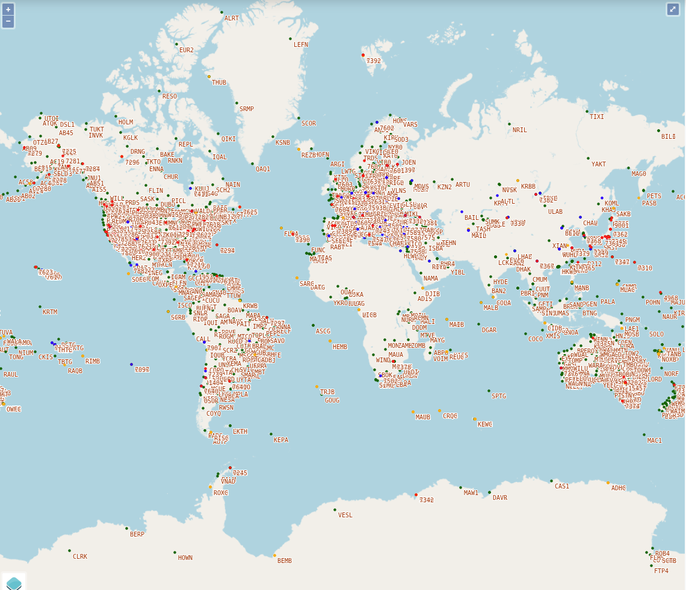{fig-align="center" width="600"}

[Source: https://itrf.ign.fr/en/network/map] {.small}

---

## ITRF realisations over time

| Realisation | Reference epoch | Released |
|------------|----------------|----------|
| ITRF2000 | 1997.0 | 2001 |
| ITRF2005 | 2000.0 | 2007 |
| ITRF2008 | 2005.0 | 2010 |
| ITRF2014 | 2010.0 | 2016 |
| **ITRF2020** | **2015.0** | **2022** |

Each includes **station velocities** — because plates move.

Coordinates are only valid at the reference epoch.

---

## ETRS89 — Europe's solution

Problem: in ITRF, European stations drift ~2.5 cm/year northeast.

Solution: **ETRS89** — a reference frame that **moves with the Eurasian plate**.

- Coordinates of European stations stay (nearly) constant over time
- Coincided with ITRF at epoch 1989.0
- Used by all European national mapping agencies

<!-- {fig-align="center" width="600"} -->

# WGS 84 {background-color="#1a1a2e" style="color: white;"}

---

## WGS 84

| Property | Value |
|----------|-------|
| Ellipsoid | $a$ = 6,378,137 m, $1/f$ = 298.257223563 |
| Origin | Earth's centre of mass |
| Maintained by | US NGA (National Geospatial-Intelligence Agency) |
| Realised through | GPS satellite orbits + ~17 tracking stations |

---

## WGS 84 Realisations

- **Original (1987)** — based on Doppler observations, ~1–2 m accuracy
- **G730 (Jan 1994)** — aligned to ITRF91
- **G873 (Jan 1997)** — aligned to ITRF94
- **G1150 (Jan 2002)** — aligned to ITRF2000
- **G1674 (Feb 2012)** — aligned to ITRF2008
- **G1762 (Oct 2013)** — aligned to ITRF2008
- **G2139 (Jan 2021)** — aligned to ITRF2014

The "G" number is the **GPS week number** when the realisation became operational.
 
---

## WGS 84 — how it is tied to ITRF

WGS 84 is periodically **re-aligned** to the latest ITRF:

1. NGA computes coordinates of its tracking stations **in ITRF**
2. These become the new **WGS 84 station coordinates**
3. GPS orbits are computed relative to these stations
4. Your receiver's position is effectively in that realisation

# Why Latitude and Longitude Are Not Unique {background-color="#1a1a2e" style="color: white;"}

---

## The same lat/lon can mean different places

The values $\varphi = 51.969°$, $\lambda = 7.665°$ are just numbers.

Their meaning depends on:

- **Which ellipsoid?** (Bessel, GRS 80, WGS 84 ...)
- **Which datum?** (DHDN, ED50, ETRS89, WGS 84 ...)
- **Which realisation?** (WGS 84 G730 vs. G2139 ...)
- **Which epoch?** (2010.0 vs. 2025.0 in ITRF ...)

---

## How much can it shift?

The same physical point — different lat/lon depending on the datum:

| From → To | shift |
|-----------|--------------|
| ED50 → WGS 84 (Münster) | 118.9 m|
| NAD27 → NAD83 (New York)  | 36.4 m | 
| DHDN → ETRS89 (Münster)| 163 m |
| ITRF2014 epoch 2010 → epoch 2025 | 40 cm (2.5 cm per year) |
| WGS 84 (1990) → WGS 84 (2024) | ~1–2 m (documented) |

Without knowing the datum, coordinates are **ambiguous**.

---

## Summary

1. The Earth is not mathematical → we approximate with **geoid** and **ellipsoid**

2. A **coordinate system** defines axes, units, directions — but is abstract

3. A **datum** anchors the coordinate system to the real Earth

4. **CRS = Coordinate System + Datum** — the complete package

5. Local datums (pre-satellite) → geocentric datums (post-satellite)

6. **ITRF** is the most accurate global frame; **ETRS89** is Europe's plate-fixed version

7. **WGS 84** is periodically aligned to ITRF but has multiple realisations

8. Latitude and longitude are **not unique** without specifying the CRS

---

## Some videos explaining the concepts

https://www.youtube.com/watch?v=kXTHaMY3cVk

https://www.youtube.com/watch?v=ZFe_rZccGOQ

---

## For Lecture 3

Read Chapter 3 of “datums and map projection” (1st
edition) and sections 2.3.4 to 2.5.2 of the coursebook

Think about:

- Are vertical datums related to horizontal datums? If yes, in which way?
- List two different types of height, and name their differences.
- What is the difference between the normal and the vertical?
- Why could the adoption of a single vertical datum over large distances be problematic for height measurement?

Submit questions to Learnweb by Wednesday noon.