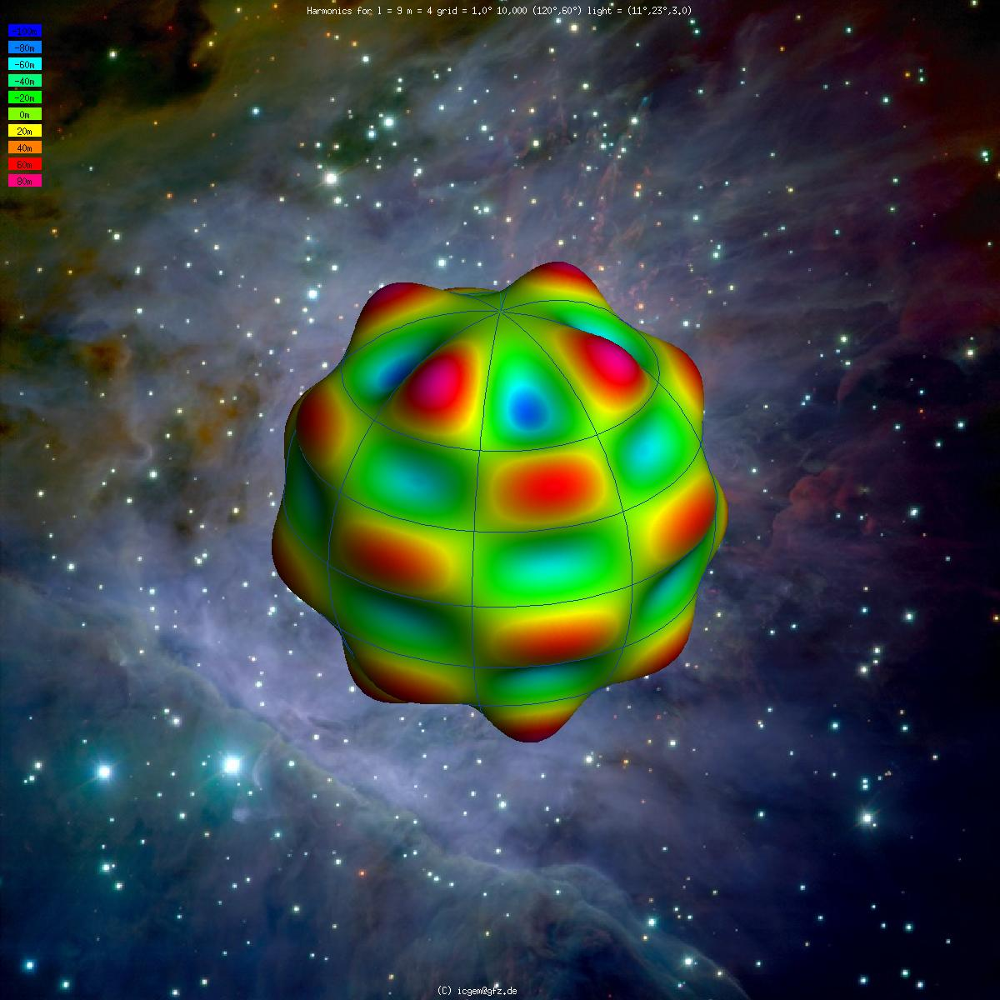

## Reading Guides

-   Chapter 2 2.3.4 onwards and 1st edition book Chapter 3
    -   [Are vertical datums related to horizontal datums? If yes, in which way?]{.smaller}
    -   [List two different types of height, and name their differences.]{.smaller}
    -   [What is the difference between the normal and the vertical?]{.smaller}
    -   [What is a tide gauge?]{.smaller}
    -   [Why could the adoption of a single vertical datum over large distances be problematic for height measurement?]{.smaller}

## Geoid

-   The **true shape** of the Earth is called the **geoid**
-   Defined as: *that equipotential surface that most closely corresponds to mean sea level*
-   The geoid is a real physical surface dictated by gravity — we approximate it using gravitational models (e.g., EGM2008), but the geoid itself exists independently of our models
-   The spheroid/ellipsoid is the simplified mathematical approximation
-   Spheroid approximates the geoid to within ±100 m (RMS ~30 m)

## Geoid as an Equipotential Surface

-   Equipotential surface: A surface everywhere **perpendicular to the direction of gravity**
-   Gravity is affected by irregularities in density of Earth's crust and mantle
-   Therefore the equipotential surface is **somewhat irregular**

##  Discussion Questions: Geoid Concepts

-   [*"Is the geoid a model or the name of the actual shape of the Earth? Is there any difference between actual and true shape?"*]{.smaller}

-   [*"In my understanding, equipotential describes a vector at each position that points towards the center. How does it follow that there are different heights?"*]{.smaller}

-   [*"Why must every diagram of the geoid greatly exaggerate its deviation from the spheroid?"*]{.smaller}

##  Answers: Geoid Concepts

-   **Model or actual shape?** Both — "geoid" is the name for the real shape; "equipotential surface" describes what kind of surface it physically is.

-   **Equipotential doesnot mean pointing to centre.** Gravity doesn't point exactly to the centre because of mass irregularities. Equipotential means same gravitional potential, not same direction. 

-   **Why exaggerate diagrams?** Deviation is less than 100 m over a body of ~6400 km radius. At true scale, geoid and spheroid would be **indistinguishable**.

## Vertical and Normal

-   **Vertical**: direction of gravity at a point (what plumb line shows); perpendicular to the geoid; **natural direction**
-   **Normal**: Geometric perpendicular to the spheroid/ellipsoid, **Mathematical direction** computed from an equation.
-   The angle between them = **deviation of the vertical** (ξ, η)
-   Typically a few **seconds of arc**

##  Discussion Questions: Vertical vs Normal

-   [*"Why is the term vertical used for geoid and normal for spheroid? Does the difference lie in shape, definitions, or both?"*]{.smaller}

-   [*"What is meant by the deviation of the vertical and why does it exist?"*]{.smaller}

-   [*"Please discuss: astronomical coordinates are always unique (it is impossible for two points to have the same latitude)"*]{.smaller}

##  Answers: Vertical vs Normal

-   **Different terms because different concepts.** "Vertical" = physics (gravity defines it). "Normal" = geometry (maths defines it).

-   **Deviation of the vertical** = the small angle between the two directions. Exists because local mass anomalies pull gravity slightly away from the geometric normal. Typically just a few arcseconds.

## Spherical Harmonic Expansion

-   The geoid globally is expressed as a **spherical harmonic expansion**
-   Like a **Fourier series on a sphere** — sum of functions of increasing spatial frequency
-   Low-degree terms → broad, continent-scale features
-   High-degree terms → fine, local details
-   Smallest wavelength: **λ = 180° / N~MAX~**

| N~MAX~ | Wavelength | Resolution |
|---|---|---|
| 36 | 5° | ~500 km |
| 360 | 0.5° | ~50 km |
| 2190 | 0.08° | ~9 km |

## Spherical Harmonic Expansion

[Ince, E. S., et al. (2019). ICGEM–15 years of successful collection and distribution of global gravitational models. Earth system science data, 11(2), 647-674.]{.gray .smaller}

##  Discussion Questions: Spherical Harmonics

-   [*"How much do we need to know about the coefficients of a spherical harmonic expansion?"*]{.smaller}

-   [*"What is the wavelength, as in 'the global Earth model expresses the geoid in terms of functions of increasingly small wavelength' — how can one imagine it?"*]{.smaller}

##  Answers: Spherical Harmonics

-   **How much to know?** Conceptual understanding is sufficient: it's a Fourier series on a sphere. Higher degree = finer detail. N~MAX~ sets the resolution limit at 180°/N~MAX~. 

-   **Wavelength:** visualizations are [here](https://icgem.gfz.de/vis3d/tutorial)

## Heights: Ellipsoidal vs Orthometric

[<https://canadiangis.com/canadian-geodetic-vertical-datum-cgvd2013-is-now-available.php>]{.gray .small}

## Heights: The Relationship

-   **Ellipsoidal height (h):** distance from the ellipsoid — what **GPS gives**
-   **Orthometric height (H):** distance from the geoid — "**height above sea level**"
-   Relationship: **h = H + N**
-   Or in relative terms: **Δh = ΔH + ΔN** -> mostly used in practice in this form

## Why GPS Gives Ellipsoidal Height

-   GPS measures **distances from satellites** → computes 3D position (X, Y, Z)
-   These Cartesian coordinates are projected onto the **WGS84 ellipsoid** → gives h
-   GPS is purely **geometric** — it measures distances, not gravity
-   The geoid is a **physical/gravity-based** surface — GPS cannot "see" it
-   To convert: **H = h − N** → we must know the separation N

## How Orthometric Height Is Obtained

-   Orthometric height is obtained by **levelling**. 
    [see this video for basics of levelling](https://youtu.be/SPCewaAfqPA?t=225)
-   Start at a **tide gauge** — H = 0
-   Measure height differences step-by-step with a level instrument and calibrated staffs
-   Establish **bench marks** with known H values across the country
-   For precise applications: corrections needed for convergence of equipotential surfaces

##  Discussion Questions: Heights

-   [*"Why does geoid-spheroid separation need to be used to correct heights from GPS? Why do satellites observe height from the spheroid?"*]{.smaller}

-   [*"How do you get height above geoid or mean sea level in reality?"*]{.smaller}

-   [*"How can you measure the orthometric height H which is required to calculate the ellipsoidal height h?"*]{.smaller}

-   [*"For accurate 3D measurements, is it required to take N for every point separately? How does modern surveying equipment handle this?"*]{.smaller}

##  Answers: Heights

-   **Why GPS gives spheroidal height:** GPS is geometry-based (satellite distances). Computes cartesian 3D coordinates X,Y,Z that are transformed to an elliposidal coordinate — so it can only reference the ellipsoid, not the geoid.

-   **How to get H in reality:** By **levelling** from a tide gauge (H=0) outward through a network of bench marks.

-   **N for every point?** Ideally yes. Modern equipment uses **built-in geoid models** (e.g., EGM2008) to automatically compute N and convert h → H in real-time. Accuracy depends on the geoid model quality at that location.

## Local vs Global Datums and N

-   **WGS84 (global):** one spheroid best-fitting the entire Earth — may be offset locally
-   **Local datum:** spheroid positioned to fit the geoid closely in a specific region
-   With a local datum, the **slope of the geoid is less severe** — N varies less
-   "Slope" = how quickly N changes as you move horizontally
-   UK example: N ranges only 0–5 m with respect to British datum (not true w.r.t. WGS84)

## Can N Be Considered Constant? (Section 3.1.1)

-   **cm-level accuracy:** not safe to assume constant beyond ~200 m
-   **2 m accuracy:** constant over ~30–50 km
-   But in some regions, N changes by 10 m over just 50 km
-   Local datums ease this — geoid slope is gentler
-   But short-wavelength undulations persist regardless

## Geoid as a Uniform Slope (Section 3.1.2)

-   Critical for **GPS applications**: if the geoid approximates a **sloping plane**, the slope is absorbed by **similarity transformations** when tying to local control points
-   Only **non-linear bumps** (undulations) remain as residual errors

| Section length | Precision of slope model |
|---|---|
| ~50 km | ~50 cm |
| ~20 km | ~10–15 cm |

-   Results from fairly rugged terrain (heights up to 1000 m); flatter terrain → better

##  Discussion Questions: Separation and GPS

-   [*"When modeling N as a uniform slope, do shorter distances always result in more accurate representations?"*]{.smaller}

-   [*"How does the acceptable error (50 cm over 50 km, 10–15 cm over 20 km) influence decisions in precise GPS applications?"*]{.smaller}

##  Answers: Separation and GPS

-   **Shorter = always better?**  It depends on **terrain roughness**. A 20 km section over mountains may be worse than 50 km over flat land. Shorter distances just reduce the chance of encountering undulations.

-   **Influence on GPS decisions:** These errors set **project size limits**. For cm-level work, GPS baselines should be short and tied to dense control. For 0.5 m tolerance, ~50 km baselines are acceptable. The transformation absorbs the linear slope — only the residual undulations limit accuracy.

## Advantages of Ellipsoidal Heights

-   Not all applications need a gravity-based height reference
-   **Volcano monitoring:**
    -   Only need **change** in height over time → Δh = ΔH
    -   N is constant at the same point
    -   Avoids false changes from improved geoid models in future
-   **Aircraft landing:**
    -   Aircraft (GPS) and obstacles both surveyed in ellipsoidal height
    -   Height clearance = h~aircraft~ − h~obstacle~ → N cancels out

##  Discussion Questions: Height Applications

-   [*"In what situations would using ellipsoidal heights be more advantageous than gravity-related heights?"*]{.smaller}

-   [*"Why is the orthometric height generally preferred in construction and engineering?"*]{.smaller}

##  Answers: Height Applications

-   **Ellipsoidal preferred when:** monitoring change over time, comparing GPS-surveyed objects to each other, or when gravity direction is irrelevant.

-   **Orthometric preferred in construction because:** water flows downhill relative to the **geoid**, not the ellipsoid. Construction needs a physically meaningful height tied to gravity.

## Mean Sea Level

-   MSL is measured over a long period
-   This covers all major tidal constituents (moon, sun, resonance effects)
-   MSL ≈ geoid, but not exactly — permanent ocean currents cause up to ~1 m difference
-   <https://www.youtube.com/watch?v=q65O3qA0-n4>

##  Discussion Questions: Mean Sea Level

-   [*"What is the significance of 18.9 years in measuring mean sea level?"*]{.smaller}

-   [*"What is the purpose of tide gauges for the vertical ellipsoid height?"*]{.smaller}

##  Answers: Mean Sea Level

-   **18.6 years (lunar nodal cycle):** related to moon's cycle, so to average all the tidal effects.

-   **Tide gauges and ellipsoidal height:** Tide gauges define H=0 (the starting point for orthometric heights). If one puts the GPS there and measures the ellipsoidal height, then the link can be established.

## National Datum Offsets (Rapp, 1994)

-   Each country's tide gauge sits on a **slightly different equipotential surface**
-   Rapp compared N from two independent methods:
    1.  **N = h − H** (GPS minus levelling) → tied to **local** tide gauge
    2.  **N from global model** → tied to the **ideal** geoid
-   The mismatch = country's **datum offset** from the ideal geoid

| Country | Offset |
|---|---|
| Germany | +4 cm |
| USA (NGVD29) | −26 cm |
| Great Britain (Newlyn) | −87 cm |
| Australia (Mainland) | −68 cm |

## Multiple Tide Gauges Problem

-   Australia AHD71: **30 tide gauges** around the coast
-   Each establishes the datum at a different equipotential surface
-   The reference surface **changes gradually** from place to place

##  Discussion Questions: Vertical Datums

-   [*"Why could the adoption of a single vertical datum over large distances be problematic?"*]{.smaller}

-   [*"Is there a good rule of thumb for how many vertical datums you'd need over larger distances?"*]{.smaller}

-   [*"Why do we define vertical datums using MSL? Why not use Mt. Everest as reference?"*]{.smaller}

-   [*"Does cut-and-fill of large areas affect the geoid?"*]{.smaller}

-   [*"Can you clarify Figure 3.6 (1st edition) and how it relates to vertical datums?"*]{.smaller}

##  Answers: Vertical Datums

-   **Single datum problematic because:** MSL differs at different tide gauges (different equipotential surfaces). Over large distances, these offsets accumulate. Channel Tunnel example: UK–France offset was ~30 cm.

-   **Rule of thumb?** No fixed rule. Depends on required accuracy and the variability of MSL along the coast.

-   **Why not Mt. Everest?** MSL is physically meaningful — tied to gravity, accessible globally via tide gauges, and water/engineering applications reference it naturally. A mountain peak is local, inaccessible, and has no physical connection to gravity equipotential.

-   **Cut-and-fill affecting geoid?** Negligibly. The geoid responds to **larger scale mass distribution**, not surface-level earthworks. 

-   **Figure 3.6:** Shows how tying a datum to multiple tide gauges creates a reference surface that **warps between different equipotential surfaces**

## Vertical Datums for Marine Applications

-   MSL is **inappropriate** for nautical charts in tidal areas
-   At low tide, actual depth available **< depth shown relative to MSL**
-   **Chart Datum** is used instead — typically set at **Lowest Astronomical Tide (LAT)**
-   Charted depths represent the **minimum** available

| Datum | Used for | Reference level |
|---|---|---|
| LAT / Chart Datum | Depth below water | Lowest expected water |
| MSL | General heights | Average water level |
| MHWS | Bridge clearance | High water level |

## Marine Datums: Key Details

-   Chart Datum is defined **locally** at discrete tide gauge points
-   LAT is not an equipotential surface — it varies with tidal range and coastal topography
-   Along south coast of England, LAT differs from ODN by:
    -   Newlyn: −3.05 m | Portsmouth: −2.73 m | Dover: −3.67 m | Bristol: −6.50 m
-   Between gauges, interpolation uses **co-tidal** and **co-range** charts
-   For **offshore engineering**, Chart Datum is inappropriate — MSL (equipotential) is needed for correct relative seafloor depths

##  Discussion Questions: Marine Datums

-   [*"What are co-tidal and co-range charts?"*]{.smaller}

-   [*"How do vertical CRS based on water level datums differ from onshore systems?"*]{.smaller}

-   [*"Wouldn't it be easier to have an internationally usable height standard for marine applications connected to GPS?"*]{.smaller}

##  Answers: Marine Datums

-   **Co-tidal charts**: 

-   **Water level datums differ from onshore in two ways:** (1) they use **depths** not heights, and (2) they are **not equipotential surfaces** — LAT varies with local tidal range and marine topography.

-   **GPS-based marine standard?** 

## Engineering Datums and CRS

-   Used for local projects: construction sites, offshore, moving platforms
-   **Datum point:** a physical mark with assigned coordinates
-   Coordinates chosen to **avoid negative values** in project area eg. 1000m
-   **Plant north:** a direction aligned with the site — may differ from geographic north
-   Height may be loosely related to actual height above sea level or arbitrary
-   Moving platforms (ships, aircraft): datum origin on the object or virtual intersection of axes

## Compound Coordinate Reference Systems

-   Often need 3D positions: easting, northing **+ gravity-related height**
-   Two **independent** CRS are combined:
    -   Horizontal (projected or geographic CRS)
    -   Vertical (vertical CRS)
-   Examples:
    -   British National Grid + Ordnance Datum Newlyn
    -   Map Grid of Australia + AHD height
    -   NAD83 + NAVD88
-   A compound CRS is **not** a true 3D geodetic system

## Registers of Coordinate Reference Systems

-   Rather than specifying all CRS details, use a **registry identifier**
-   Examples: BKG, EPSG Geodetic Parameter Dataset
-   Each CRS gets a unique code (e.g., EPSG:4954 for NAD83 geocentric)
-   Care needed: ensure registry definition **exactly matches** your requirements
-   Repositories retain erroneous records (marked invalid) for **historic purposes**

##  Discussion Questions: Datums and CRS

-   [*"Are vertical datums related to horizontal datums? If yes, in which way?"*]{.smaller}

-   [*"Why can't we combine a 3D geodetic system and gravity-related vertical system as a compound CRS?"*]{.smaller}

-   [*"Is the unit of measurement standardized, or is conversion between units still widespread?"*]{.smaller}

##  Answers: Datums and CRS

-   **Vertical related to horizontal?** Defined independently, but linked through **h = H + N**. Combined in practice as compound CRS. Changing one doesn't change the other — but we need both for 3D positioning.

-   **Why not 3D geodetic + gravity vertical?** Because they use fundamentally different reference surfaces (ellipsoid vs geoid). A compound CRS acknowledges they are separate systems. A true 3D system would need a single consistent surface.

-   **Unit standardization?** 

## Next Lecture

-   **07.05.2026 - Chapter 3**
-   Read Chapter 3.1 - 3.5 on Map Projections

### Reading Guide

-   Answer **(for yourself) ** the following questions:

1.  Name a key difference between the grid and the graticule
2.  Does a map projection have one or many scale factors?
3.  What are false easting and northing, and what is their purpose?
4.  Name two properties of a "good" map projection
5.  What is UTM?