## Reading Guides

Reading: Chapter 3.1 - 3.5 on Map Projections

1.  Name a key difference between the grid and the graticule
2.  Does a map projection have one or many scale factors?
3.  What are false easting and northing, and what is their purpose?
4.  Name two properties of a "good" map projection
5.  What is UTM?

## True size - web mercator

[True size](https://thetruesize.com/)

## Why Projection?

- Presentational purposes
- Computational purposes

## Distortion while projecting
 [very old video](https://www.nfb.ca/film/impossible_map/)

## Fundamentals
- grids and graticules
- Scale factors
- Sphere or ellipsoid
- Developable surfaces

## Fundamentals: Grids and graticules
- **Graticules**: meridians and parallels that appear on the maps 
- Their appearance depends on type of projection
- Doesn't constitute the basis of crsthat is suitable for computational purposes or for placing features on map
- Instead recrtangular crs = **grids** is superimposed on the grids
- Grids have coordinates labelled as x, y or E, N 

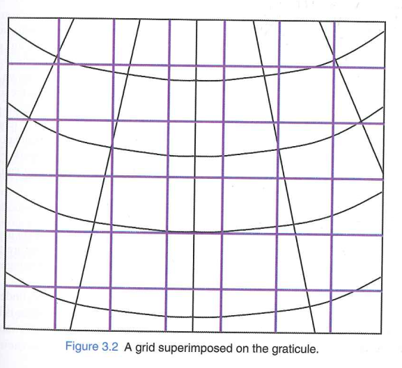{fig-align="center" width="600"}

## Fundamentals: Scale factors
- Distortions are inevitable when flattening 
- **Scale factors** help in quantification of the amount fo distortion
- ideal value is 1 -> meaning no distortion at that point
- scale factor is different in each point in the projection and in cases each direction has different values
- so the formula for computation is computed at an infintisemaly short distances and 
- for longer lines this parameter is the mean of point scale factors along the whole length.

## Fundamentals: Scale factors

- Scale factors shown in direction of meridian and parallel
- unrelated to the scale of the map 1:1000
- not to be associated with the error -> as true coordinates will always be recovered if the values fo the parameters of the projections are known.

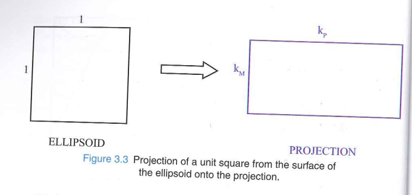

## Developable surfaces
- Intermediate surfaces of a nature that can be unravelled wihtout distortion
- Cones, Cylinders and plane
- they are brought to the contact of the Ellipsoid
- 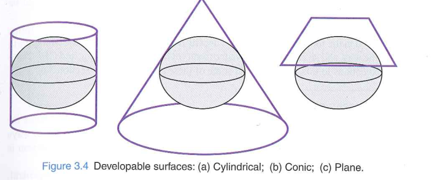

- In the region arond the point or line of contact between the two surfaces the scale factor distrotion will be minimal

## Choice of developable surface

- When projecting the whole Earth, which developable surfaces are better in which geographical extent?
- Cylindrical: ?
- Conic: ?
- Planar: ?

## Choice of developable surface
- When projecting the whole Earth, which developable surfaces are better in which geographical extent?
- Cylindrical: equatorial region
- Conic: Mid-latitude
- Planar: poles

## How is projection done?
- Mathematically 
- E, N = $f$($\phi$, $\lambda$)
- So, without mentioning the developable surfaces projection is possible if we know the $f$
- Softwares do it the same way

## Preserved features
- Transferring coordinates from sphere/ellipsoid needs some rules
- Choice needs to made on these rules depending on the purpose
- It is not possible to devise a projection without introducing distortions.
- Generally either shape, area or size of the feature will be different after projection
- Usual approach is to preserve one of these properties at expense of others

## Preserved features- distance
- distance measured on the sphere undistorted when shown on the projection
- it is not possible to preserve all the distances
- so instead could be preserving along all meridians i.e. $k_m$ = 1
- Also known as equidistant projection
- 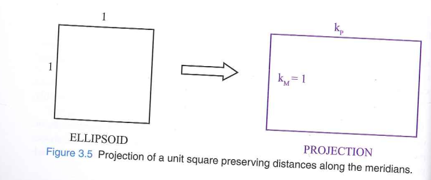

## Preserved features - Area
- Equal area projection
- 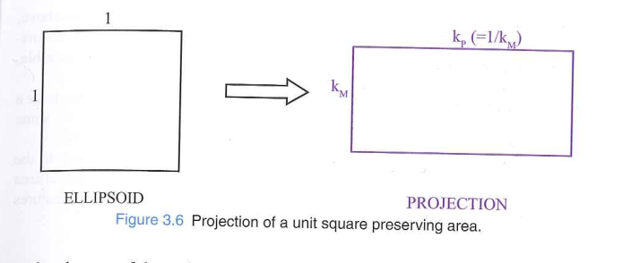

## Preserved features - Shape/Angles
- Conformal
- Significant in land surveying
- 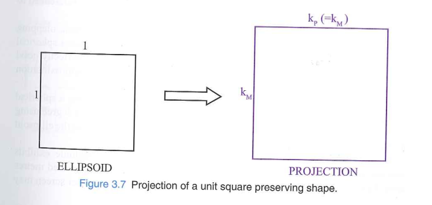

## Projection systems
[video link](https://www.youtube.com/watch?v=kIID5FDi2JQ)

## Spehers and ellipsoids

- Most ellipsoids have a flattening of approximately 1 part in 300. 
- While subtle, ignoring this leads to significant coordinate discrepancies.

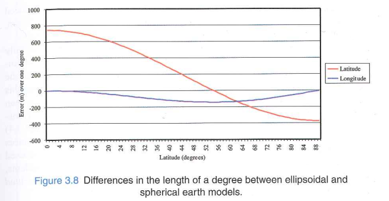

## Discussion questions

- In the last paragraph of the section 3.2.5 the author wrote that the ellispoid is not a conformable surface. Therfore, the ellipsoidal systems first convert from the ellipsoid to sphere. 
The question is which approach is better or would induce more distortion, directly assuming the shape as sphere or, converting from ellipsoid to sphere.

## Answers

- **Direct sphere assumption:** Treats Earth as a perfect sphere from the start. Simple math, but ignores the ~1/300 flattening — causes positional errors of hundreds of meters at mid-latitudes.
- **Ellipsoid → Sphere → Plane (Conformal sphere approach):** Mathematically maps the ellipsoid onto an auxiliary "conformal sphere" first, then projects. Errors are vastly smaller (sub-meter level).
- **Conclusion:** Converting from ellipsoid to sphere first is the better approach — it preserves geodetic accuracy.  
- Directly assuming a sphere is only acceptable for low-precision/visualization tasks (e.g., Web Mercator).

## Natural and false origin
- Natural origin : point on equator (0 latitude) and free to choose longitude
- False origin: Startign at different latitude
- Geographic coordinates of natural or false origin are essential part of definition of projected referene system.

## False Easting and False Northing 
- origins are given some coordinates eg 500,000 to avoid negative coordinates

## Discussion questions
- Clarify why False Northings and Eastings are necessary.....its already clear that they help to avoid -ve coordinates. But why still avoid -ve coordinates in the current world of high computation capability
- Why are non-natural origins often preferred over natural origins when defining coordinate systems in map projections?

## Answers

- **Why avoid negative coordinates (even today):**
  - Reduces *human* errors — surveyors, planners often drop signs, causing mirrored mistakes.
  - Simplifies sorting, indexing, and storage in databases (positive values only).
  - Maintains backward compatibility with legacy maps and tools.
  - Visual/printed grids are easier to read with all positive values.
- **Why non-natural origins are preferred:**
  - Natural origins (Equator + central meridian) often lie far from the map's region of interest, producing huge coordinate values.
  - Shifting the origin closer to the area of interest keeps numbers manageable and intuitive.

## Cylindrical Projections

### Equidistant

- $k_m$ = 1
- distances along meridian are undistroted
- parallels are same size as latitude

## Cylindrical Projections

### Equal area

- Compensate the distortion on parallels ($\sec\phi$) by setting $k_m$ = $\cos\phi$ 
- distances are distroted in meridian and function of latitude
- **Peters projection**: apply further scaling of 0.5 along parallels and 2 along meridians
- Used to show correct relative size 
-[read more here](https://en.wikipedia.org/wiki/Gall%E2%80%93Peters_projection)

## Cylindrical Projections

### Conformal/Mercator

- $k_m$ = $k_p$ = $\sec\phi$
- Poles can't be represented as they are infinite size and infinite distance from equator
- meridians are parallel to each other and angles are preserved
- ideal for navigation

## Cylindrical Projections

### Conformal/Mercator

- Different scales at different latitudes ($\sec\phi$)
- between 49 degrees and 51 degress 1.52 and 1.59
- **overall scaling** is applied, so that scale factor on average is closer to 1
- in example overall scaling of 0.645 is used to reduce the scale factor to 0.98 to 1.03 and scale on equator will be 0.645 

## Cylindrical Projections

### Transverse Mercator

- 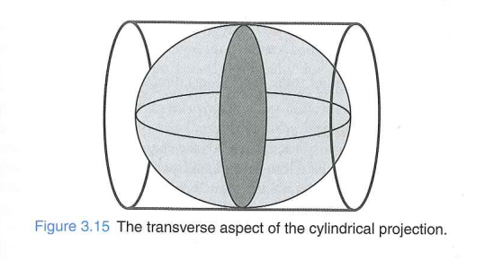
- cylinder contacts **not equator** but a Meridian (central meridian)
- $k = \sec\theta$, $\theta$, analogous to $\phi$, angular distance from central meridian
- meridians are **not parallel** to each other and **not straight lines** 
- only central meridian is straight line

## Cylindrical Projections
 
### Transverse Mercator

- commonly used for narrow band of 6 degrees (+-3 degrees from CM)
- Scale factor at CM = 1, at 1.0014 on edges
- overall scaling is done by choosing scale factor at nautral orgin (usually 0.9996)

- 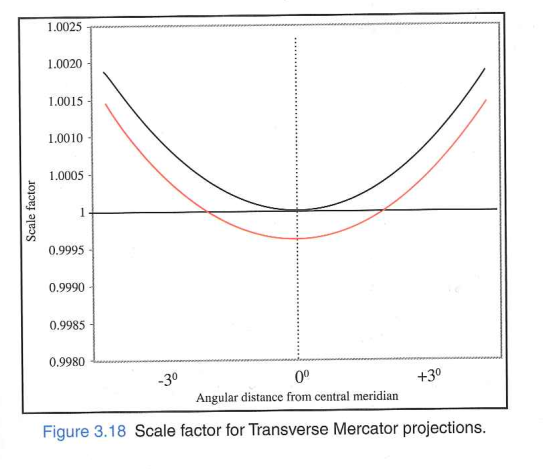

## Cylindrical Projections
 
### Universal Transverse Mercator

- Zoned TMs
- 60 zones 
- Germany lies zone 31, 32, 33

- 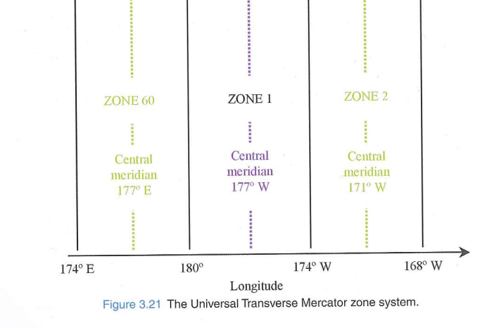

## Cylindrical Projections
 
### South oriented Transverse Mercator

- central meridian oriented towards South Pole
- Grid values increase towards the west and south.

## Cylindrical Projections
 
### Oblique Transverse Mercator

- when region/country doesnot align along a meridian or parallel
- eg Peninsular Malaysia, Alaska Panhandle

## Cylindrical Projections

## Discussion questions:
- Why is the Transverse Mercator projection method more suitable for regions with a large extent north-south but little extent east-west?

- Should map projections such as the Mercator projection be avoided in education because they can create misleading perceptions of the size of countries and continents? For example, Greenland often appears almost as large as Africa on Mercator maps, even though Africa is actually about 14 times larger than Greenland.

- If a loxodrome is not the shortest path between points, why is it the preferred method instead of for example the great circle route?
 [video link](https://www.youtube.com/watch?v=3BF_ZKfJiso)

## Answers / Pointers

- **Why Transverse Mercator suits N–S regions:**
  - The cylinder touches the Earth along a *central meridian* (a N–S line).
  - Scale factor = 1 along the CM and stays close to 1 within ±3° E–W.
  - Distortion grows rapidly E–W → ideal for narrow N–S strips (Chile, UK, Norway).

- **Should Mercator be avoided in education?**

- **Why use loxodromes (rhumb lines) over great circles?** 
  - Great circles are shortest, but require continuously changing compass bearing.
  - Loxodromes maintain a *constant compass bearing* — easy to navigate manually.
  - On a Mercator map, loxodromes are straight lines → quick plotting.
  - Trade-off: longer path for navigational simplicity

<!-- 

## Conic

### Conic equidistant

-

## Conic

### Albers equal area

-

## Conic

### LCC

-

## Conic

### Oblique conic -->

## Definitions
- Projection methods: Transverse Mercator, Polar stereographic
- Map Projection: Projection methods + values of the parameters eg. UTM or British national grids
- Projected coordinate system: has datum information -> complete information

## Projection Summary

### Categories

- **Class:** Cylindrical, Conic, Azimuthal (Planar)
- **Aspect:** Normal (polar axis), Transverse (90° rotated), Oblique (angled)
- **Property:** Conformal (preserves angles), Equal Area (preserves size), Equidistant (preserves distance), compromise
- **Contact:** Tangent, Secant (intersects surface)

## Projection Summary

### When to use which?

- **By Location:**
  - *Equator:* Cylindrical
  - *Mid-latitudes:* Conic
  - *Poles:* Azimuthal
- **By Shape:**
  - *Narrow North-South:* Transverse Cylindrical (e.g., UTM)
  - *Diagonal/Skewed:* Oblique 
- **By Purpose:**
  - *Navigation / Topography:* Conformal
  - *Comparing regions / Thematic:* Equal Area
  - *Distance from a center point:* Azimuthal Equidistant

## Choice of map projection
https://projectionwizard.org/

## Tissot's indicatrix

- visualize characterize local distortions due to map projection.

https://en.wikipedia.org/wiki/Tissot%27s_indicatrix

## Question?
In this scenarios which map projection would you chose and why?

::: {.columns}

::: {.column}

1. Mid Latitude country with signicant East-West Extent (USA)

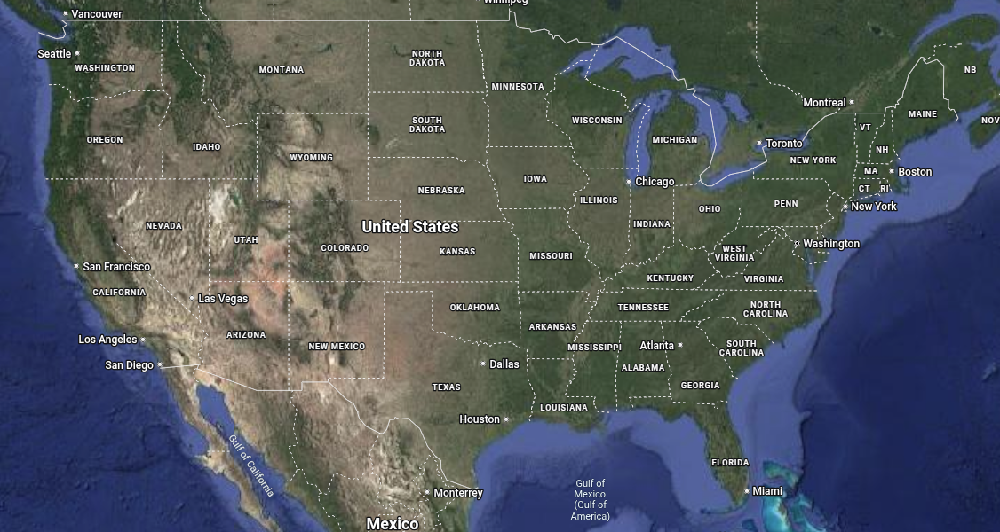

:::

::: {.column}

2. Mapping a long narrow country (Chile)

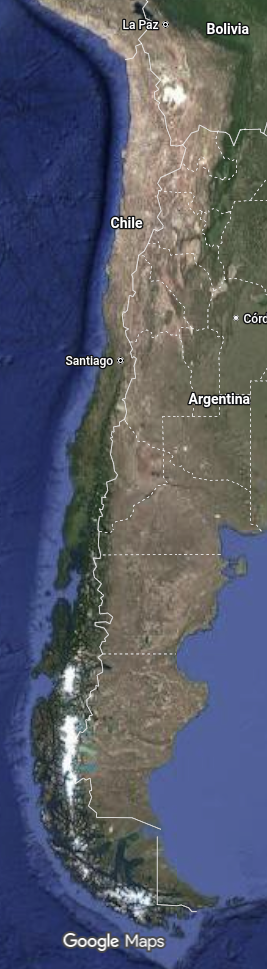

:::

:::

## Next Lecture

Read section 3.6-3.9 and try answer the following questions for yourself:

1. What parameters are required to define different classes of projection?
2. What is role of scale factor in computing within map projections?
3. What factors should be considered while designing a map projection?

## References
All figures are from:
- [Source: Iliffe, Jonathan , and Roger Lott . 2008. Datums and Map Projections for Remote Sensing, GIS,
and Surveying. Whittles Pub. CRC Press, Scotland, UK.]{.small}