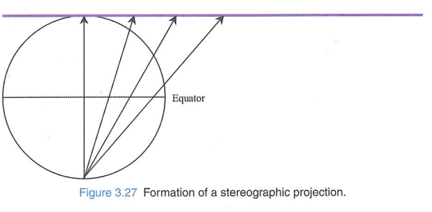
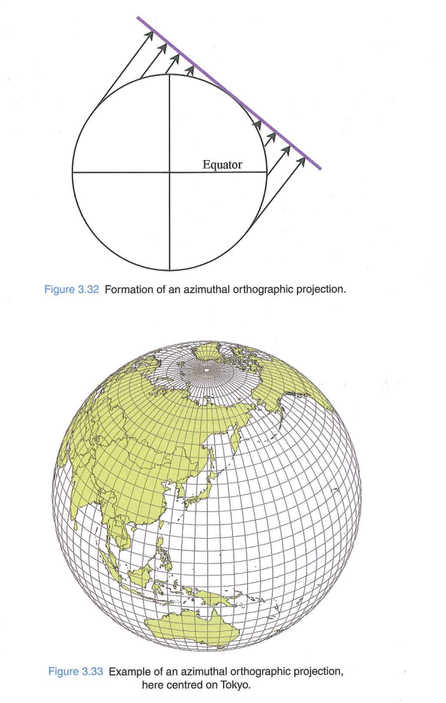
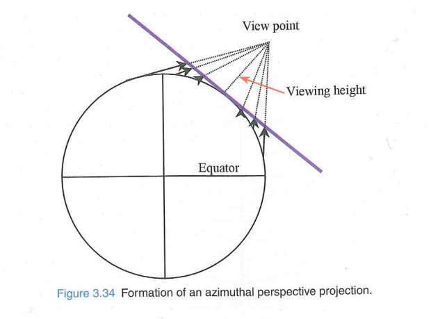
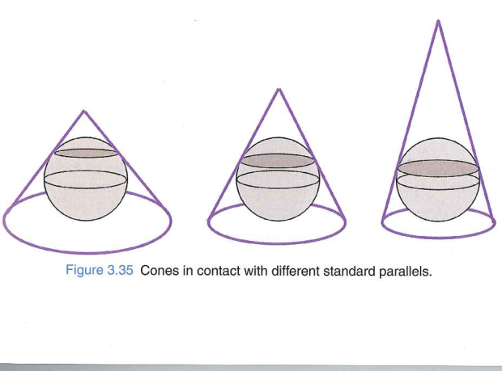
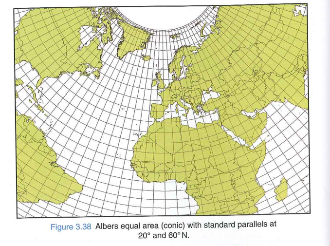
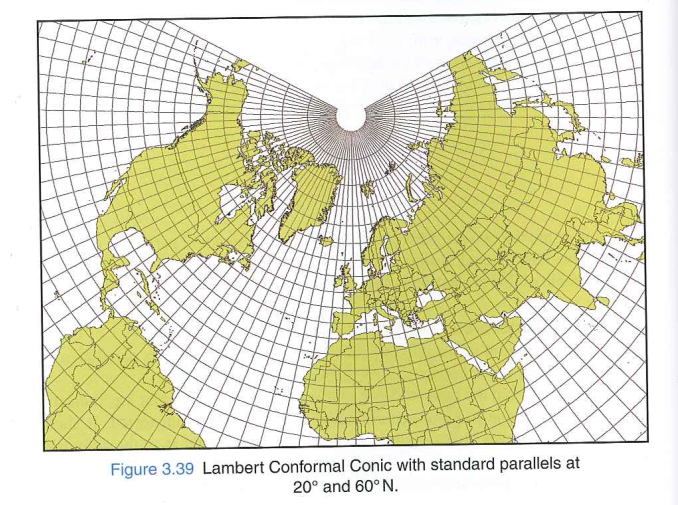
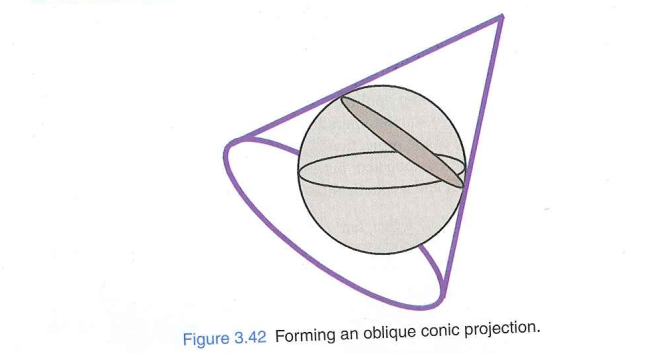

## Azimuthal Projections

### General Azimuthal 

- Formed by bringing a plane into contact with sphere or ellipsoid
- Scale factor distortion will be circularly symmetric
- Special case is Polar projection, where plane touches Poles
- Overall scaling possible such that the scale factor at the center is less than 1

## Azimuthal Projections

### Azimuthal equidistant

- Kept scale factor = 1, in the direction radial from the center of the projection.
- Polar equidistant - scale factor along meridian is $k_m$ = 1
- Distances from center will be correct

## Azimuthal Projections

### Azimuthal equal area

- Formed similar to Azimuthal equidistant but changing the scale factors such that:
  - scale factor of lines radial along the centre are inverse of scale fator in the perpendicular direction

- Example: Lambert Equal area 2001 used by European statistical mapping

## Azimuthal Projections

### Stereographic/conformal

- Conformal version of Azimuthal
- Graphical can be constructed by setting viewing Point on the opposite side of the Earth from the center of projection
- Polar stereographic used in complement the UTM in beyond latitude 84 degrees N and 80 degrees South = UPS
- UPS: scale factor of pole = 0.994 -> overall scaling

- 

## Azimuthal Projections

### Stereographic/conformal - oblique

- Oblique aspect is tangential to chosen point(origin)
- Or if oveall scaling applied scale factor is true at the small circle centred at the origin
- Used in ellipsoidal forms in places where the range of latitude is similar to range of longitude
- Eg. Netherlands RD, Romania Stereo 70, Prince Edward Island Stereographic

## Azimuthal Projections

### Stereographic/conformal- Double Stereographic

- In ellipsoidal case, steps taken are :

1. Ellipsoidal coordinates are transformed to spherical

2. Project the spherical coordinates onto the grids

On step 1, two approaces are possible

1. Convert the ellipsoidal coordinates to a conformal sphere with a radius based on the ellipsoidal radii at the projection origin or  

2. use radius based on the ellipsoidal radii at each point

This second method is sometimes also called "Double stereographic"

<!-- ## Azimuthal Projections

### Gnomonic

- formed by projecting all the points from center of earth
- seldomly used
- scale factor distortion becomes extreme away from the centre of projeciton
- Only advantage: Great circles (shortest routes between two points) are straight lines and vice versa,  but this task is replaced by computational techniques

 -->

## Azimuthal Projections
### Discussion questions:
- Why does the UPS projection use a standard parallel at 81 degrees?

## Azimuthal Projections

### Azimuthal orthographic

- formed by projecting all points on teh ellipsoid onto a plane, along lines that are normal to the plane.
- Viewing height is infinity
- Resulting in view of Earth analogous to how it would look from deep space using a telescope

## Azimuthal Projections

### Azimuthal perspective projection

- Similar to the Azimuthal orthographic but with finite view point
- used by Google Earth- not purely perspective as it accounts for height of the terrain
- 

## Conic

### General Conic

- Formed by bringing a cone into contact with the sphere/ellipsoid
- Touches the sphere/ellipsoid along a parallel of latitude -\> standard parallel
- different shapes of cones can be selected
- 
- equivalent of overall scaling achieved by using **two standard parallels**
- applicable when the region of interest is broad extent in longitude and regions that are in mid-latitude

## Conic

### Conic equidistant

- preserves scale factor along the meridian ($k_m$ = 1)
- 

## Conic

### Albers equal area/ Conic equal area projection

- 
- Pole becomes a circular arc -> shape has been compromised to keep area undistorted
- Compare wiht the cylindrical equal area the distortion is less because of mid-latitude and large east-west extent of Europe.

## Conic

### Lambert Conformal Conic (LCC)

-  widely used projection
- 
- Meridian meet at pole
- if standard parallel set at equator the meridians meet at infinity (they are parallel) same as Mercator
- and if standard parallel set at 90 degrees would be same as polar stereographic
- not to be used at extreme cases

## Conic

### Lambert Conformal Conic (LCC)

- Zoned LCC: example France Lambert 
- Zones are tiered North to South
- Zone boundaries are set midway between the parallels of origin for adjacency zones
- Other examples of LCC are Europe conformal 2001 (std parallel 1 at 65$^\circ$ N and 2 at 35 $^\circ$ N), Tennessee state plane CS83, Geoscience Australia Lambert 

## Conic

### Oblique conic 
- 
- Example of conformal case is Krovak projection used in Czech Republic and Slovakia

## Web Mercator

- Major problem: 
  - ellipsoidal model of earth + **Mercator projection formula for sphere** 

- https://www.youtube.com/watch?v=R-ENwz5u7pE
 
## Adaptive composite projection
https://berniejenny.info/demos/AdaptiveCompositeMapProjections/

## Choice of Projection system
https://www.explainxkcd.com/wiki/index.php/977:_Map_Projections

## Section 3.6 to 3.9

Reading guides:

1.  What parameters are required to define different classes of projection?
2.  What is role of scale factor in computing within map projections?
3.  What factors should be considered while designing a map projection?

## Non-geometric projection method
- with advanced technologies, it is possible to create the projections in which the central line follows feature of interest, not just meridians or parallels
- Formula $(E, N) = f(\phi, \lambda)$, here $f$ gets more complicated 
- Example: NewZealand (to fit the shape of country), Space oblique Mercator (to follow the satellite ground track), Snake projection

## Snake Projection
- For use in railways and pipelines
- there is difference between the distances measured on the surface of the Earth and one implied by the coordinates of the projected crs.
- For many Engineering applications, the procedure is: measured distance is transferred to projection after applying ellipsoidal corrections and scale factor corrections
- 

## Role of scale factor in computing wihtin map projections

## Whole earth case

## Designing custom map projections

## Designing custom map projections

-Which of these Map projections would you use for mapping population density? Airline routes? Coastal navigation? Why?
One conformal (e.g., Mercator)
One equal-area (e.g., Albers)
One equidistant (e.g., Azimuthal Equidistant)

## Next Lecture
Date: 11.06.2026

- Reading: Chapter 4.1 - 4.4 of the coursebook
- Reading guides:

1. What are two key differences between a conversion and a
transformation?
2. What is the rst step common to any transformation
endeavor?
3. What does a grid interpolation do (and why is it needed)?
4. What are similarities and differences between an Helmert
transformation and a Molodensky transformation?