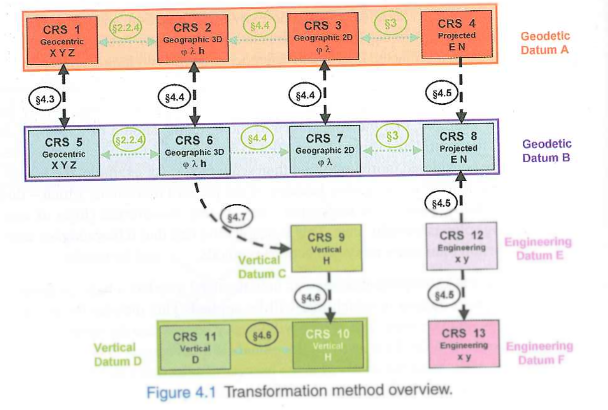
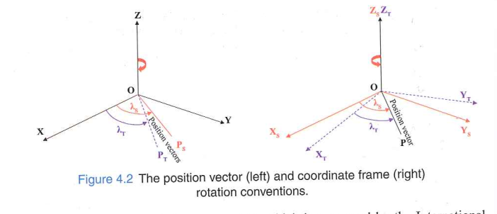
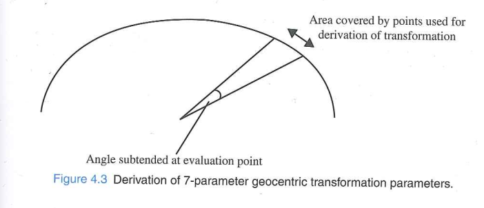
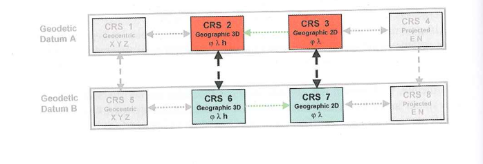
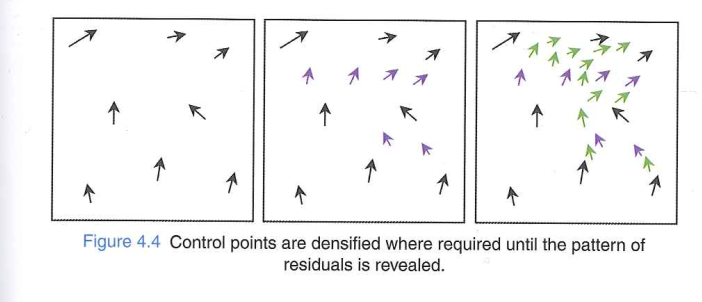
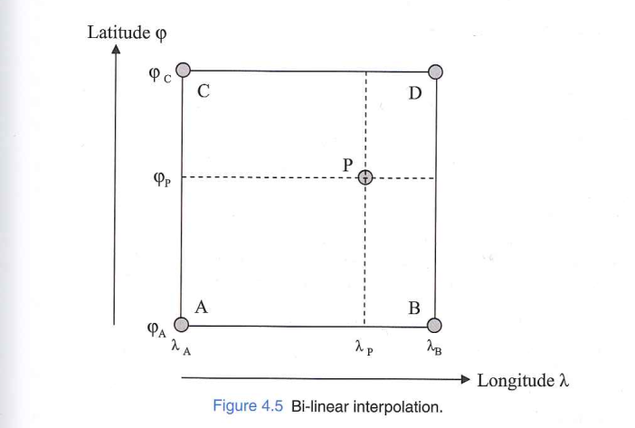
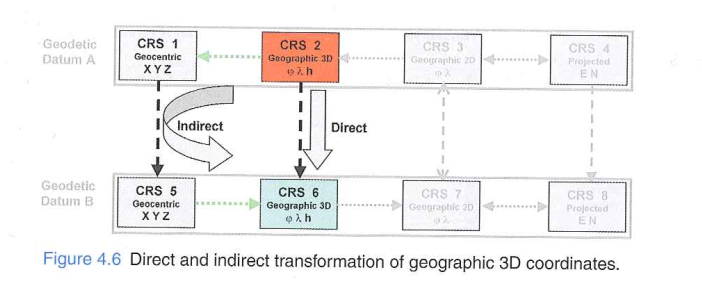
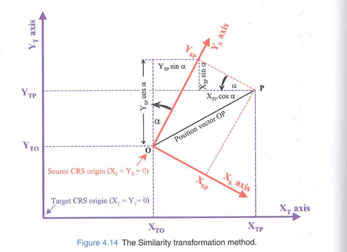

## Reading guides

- Reading: Chapter 4.1 - 4.4 of the coursebook

1. What are two key differences between a conversion and a transformation?
2. What is the first step common to any transformation endeavor?
3. What does a grid interpolation do (and why is it needed)?
4. What are similarities and differences between a Helmert transformation and a Molodensky transformation?

## Chapter guide

## Transformations and Conversions

- What are **two differences** between a conversion and a transformation?
  - Datum change 
  - Loss of accuracy 

  - **Conversions**: e.g. geocentric ↔ geographic, or map projection
  - **Transformations**: e.g. from AGD66 to GDA94 (change of geodetic datum)

## Transformation Multiplicity

- Parameters are derived from **common points** in both CRS
- Different subsets of common points → **different parameter values**
- There is generally **no single "true" transformation** between two CRS

In general, there may be many different transformations between any two coordinate reference systems.

## Transformation Accuracy

- Parameters derived by least squares → result is **internal precision**, not external accuracy
- Accuracy **varies with location** and area of coverage
- Can be estimated using nearby known points or trend fitting
- At unobserved points, accuracy is **unknown**

## Transformation Reversibility

- In terms of formulas and parameters
- Eg. Map projection methods are reversed through different formulas but same parameters
- In case of **transformations**:
  - if reverse computation is required, the formula have to be used with **different set of parameter values**
  - some transformations are not exactly reversible in theoretical sense, but in context of **application** in practical problems it can be considered reversible
  - Some can be reversed by applying same formula with **reversed sign** of some or all parameters.

## 4.3 Transformations Between Geocentric CRS
 - Reminder on what is geocentric coordinates

- Different geodetic datums and their geocentric Cartesian systems differ in:
  - Position of **origin** (offset from Earth's centre of mass)
  - **Orientation** of axes
  - **Scale**

## 3-Parameter Transformation (Geocentric Translations)

- Applies only **3 translations** (ΔX, ΔY, ΔZ)
- Assumes axes are parallel and scale is identical
- Compact — easy to store and apply
- Used in many handheld GPS devices for national mapping systems
- Accuracy typically **5–10 m**
- Ignores axis misalignment and scale differences
- Easily reversible with reversed parameters

<!-- > The most significant differences between CRS arise from offsets from the Earth's centre of mass — a 3-parameter shift accounts for a large part of the difference. -->

## 7-Parameter Transformation (Helmert / Bursa-Wolf)
- Parameters
  - **3 translations** (ΔX, ΔY, ΔZ)
  - 3 **rotations** (α~X~, α~Y~, α~Z~)
  - 1 **scale factor** (μ, near 1 — typically expressed in ppm)

- More accurate when axis alignment and scale differ between datums

## Rotation Conventions

{width=65% fig-align="center"}

- **Position Vector** (IAG standard): positive rotation = clockwise when viewed from origin along the axis
- **Coordinate Frame**: positive rotation = clockwise rotation of the reference frame
> Using the wrong convention → rotation in the **opposite direction**!

## 7-parameters: Reversibility
- uses approximation formulas valid only when transformation parameters values are small compared to the magnitude of the geocentric coordinates
- Conditionally reversible
- parameter values are applied with reverse signs to reverse the transformation

## 7-parameters: practical cases

- example of transforming coordinates from GPS to a national CRS
- National datums are realized through control points which are possibly erroneous (due to error in survey)
- So, single transformation will not provide perfect fit.
- To achieve better fit: 
  - transformation that introduces a degree of distortion to the geometry of source data, warping it into the target system (4.4.4)
  - split area into smaller patches and have different parameters for each small area (which causes discontinuities at boundaries)

## 7-Parameter: Geometric Sensitivity

{width=50% fig-align="center"}

- Rotations are about the **Earth's centre** (several thousand km from the data)
- If the area of common points is small → the angle subtended is small → **ill-conditioned**
- Rule of thumb: subtended angle should be **≥ 30°** (continent scale)

## 10-Parameter Transformation (Molodensky-Badekas)
- 3 more parameters ($X_0$, $Y_0$, $Z_0$) coordinates of a point at the centre of the survey area in source CRS
- Rotation applied about the point ($\uparrow$), not the Earth's centre
- Avoids the ill-conditioning problem of the 7-parameter for small areas
- Compared to 7-parameter: Same mathematical effect when correctly applied and Translation values look very different (but rotations are identical)
- Not strictly reversible (centre point remains in source system)

## 4.4 Transformations Between Geographic CRS

{width=50% fig-align="center"}

- Transform latitude (φ), longitude (λ), ellipsoid height (h) between datums
- Four main approaches:
  1. **Molodensky** — direct formulae
  2. **Geographic offsets** — constant correction
  3. **Grid interpolation** — spatially varying correction
  4. **Indirect** — route through geocentric CRS

## Molodensky Method

- Directly transforms geographic coordinates using:
  - Geocentric translations (ΔX, ΔY, ΔZ)
  - Ellipsoid parameter differences (Δa, Δf)

- Achieves exactly the same result as the **3-step indirect method**:
  1. Geographic → Geocentric
  2. Apply 3-parameter geocentric transformation
  3. Geocentric → Geographic

- The only advantage of the Molodensky formulae is modest computational efficiency(?).

- **Abridged Molodensky**(if you only have abacus): simplified version; for 3-parameter accuracy levels (~5–10 m), differences are not significant

## Geographic Offsets

- Apply **constant** corrections (Δφ, Δλ) across a limited area
- Derived by averaging coordinate differences at common points
- Accuracy: a few metres → suitable for **leisure or marine navigation**
- *Commonly used on nautical charts to shift GPS positions onto the chart datum*
- Only valid for the specific area it was derived over
-  Does NOT extrapolate beyond that area!

## Grid Interpolation — NTv2 and NADCON
- National CRS have **spatially varying distortions** from historical surveys
- A single transformation cannot fit the whole country well

## Grid Interpolation — NTv2 and NADCON
**Steps:**
1. Identify common (monumented) control points in both systems
2. Pattern identification:

  - In widely spread out points and derive simple similarity transformation
  - Examine the horizantal residuals from the inital transformation and identify the spatial correlation (pattern)
  - wherever the vecor is sharply chaging -> densify, thus to reveal the pattern of the residuals

  {width=72% fig-align="center"}

## Grid Interpolation — NTv2 and NADCON

3. Overlay a **regular grid** 
4. At any query point: **interpolate** from the surrounding grid nodes

{width=52% fig-align="center"}

- Correction at point P is interpolated from 4 surrounding grid nodes (A, B, C, D)
- Accuracy: **~0.1 m** — much better than geocentric methods

> Grid interpolation does NOT preserve the shape of original data — use a similarity transformation when shape matters.

## Indirect Transformation for Geographic 3D Coordinates

{width=58% fig-align="center"}

- As geocentric coordinates are referenced to Greenwich meridian, if the geographic coordinate is not refered to Greenwich it should first be corrected

## Indirect Transformation for Geographic 3D Coordinates
**In case the height is unknown**:

- assume h = 0
- Error in horizontal position is typically **< 0.5 m**
- Acceptable for **most mapping applications**

> Two-dimensional transformations can safely be carried out without knowledge of height for precision within 0.5 m.

## Question
- Which of the following transformations are irreversible:
- Geocentric:
  - 3 parameters
  - 7 parameters
  - 10 parameters
- Geographic:
  - Molodensky
  - Geographic offset

## 4.5 Transformation of 2D plane coordinates
- In many applications, only horizontal location is of interest
- Example: 
  - remotely sensed image being warped to fit the coordinates of a set of ground control points
  - GPS data being fitted to the local site grid with unknown projection or datum parameters
  - overlaying a digitised map with modern dataset on a geographic information system

- But, it is not possible to transform two absurdly different projected coordinate reference system both with unknown datum.

## Compatibility and Scale factor
- Eg. it will always be possible to transform coordinates from one conformal projected crs to another
- But **scale factor varies** within the map projection, thus a large shape can't be preserved
- Overall scaling can be applied to account for most of the difference between them.

## Similiarity transformation method
- **4 parameter** transformation method to related 2D cartesian CRS to another 2D rectangular CRS
- **Minimum 2 control points** are required
- Used when:
  - each have **orthogonal axes**
  - each have **same scale along axes**
- eg. engineering plant grids and projected CRS

{width=58% fig-align="center"}

## Similiarity transformation method
- Many mapping software packages can derive the parameters given common points in two datasets.

- Reversibility:
 - It is reversible by using alternative transformation parameter values

## Similartiy transformation method
- What are the four parameters?

## Affine transformation
- When in either system: **scale along the axes differ** or **axes are not orthogonal**
- **Six parameters** for scale and rotation adjustments independently in each direction
- At minimum **three control points** are required
- Eg. for remotely sensed images, it corrects first order distortions such as non-orthogonality and scale **difference between scan and along track directions** 
- Eg. In digitized maps, it corrects different amount of paper shrinkage in different directions 

- Reversibility:
  - is another affine transformation but with different parameter values

## Polynomials
- Second order (12 parameters): used in remote sensing for the correction of scanner data
- for such case **minimum 6 ground control** points are to be used and the **distribution** has to be distributed over the whole area to be transformed 
- Useful for correcting second-order distortion in satellite images caused due to pitch and roll, sub satellite track curvature and scan line convergence due to earth rotation, map projection, and some problems due to altitude variations along the flight path.

## Break
- Questions?

## Next lecture
next class: 25.06.2026
More details later