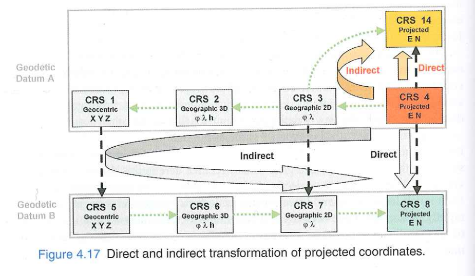
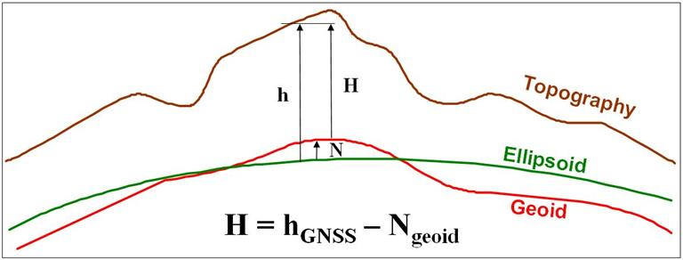
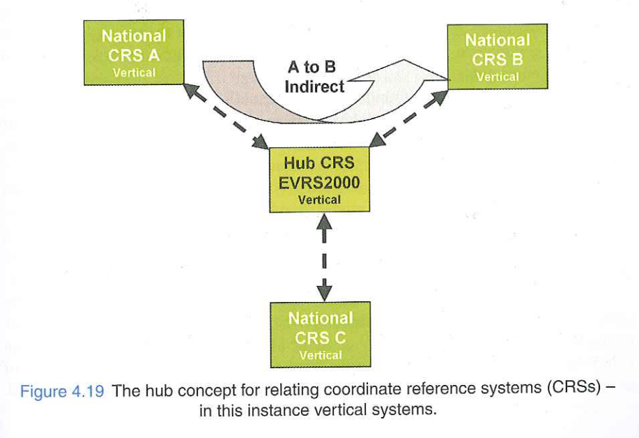

## Review of Transformation 1

### Transformations 4.1 - 4.5 of course book

- Transformations between Geocentric CRS (3,7, 10 params)
- Transformations Between Geographic CRS (Molodensky, geographic offsets, grid interpolation, indirect)
- Transformation of 2D plane coordinates (Similarity, Affine, Polynomial)

## Today's lecture

- Google Earth overlay
- How does GPS work?
- GPS data projection to local grids
- Indirect transformation between 2D projected cooridnates
- Vertical coordinates and their transformations

## Google Earth -overlays
- Google Earth visualizes earth in 3D view by using azimuthal perspective projection
- allows overlays (images, other vector layers), are by default assumed to be cylindrical equidistant projection
- User can perform 5 parameter affine like transformation
- Mismatch due to the difference between assumption of projection and actual geometry
- Mismatch larger in areas with large E-W dimension and higher latitude

## GPS/GNSS
- How does GPS work?
  - https://www.youtube.com/watch?v=AlHPDRQ08jU
  - Read chapter 5 for more details

## GPS data into local site grid
- Engineering sites often have local coordinate system without link to the national grids/global systems
- In some cases: one might have data from GPS that needs to be overlaid onto the local grids

## Transforming GPS data onto local site grid
- Deal with horizantal and vertical seperately, starting with horizantal
- **First:** convert ellipsoidal coordinates (from GPS) into projected -> selecting appropriate projection system
  - Now both are in 2D plane coordinate system
- **Second:** acquire transformation parameters using either of affine, simialarity(preferred to preserve shape) or polynomial transformation
- This works well in small areas

## Transforming GPS data onto local site grid
- what not to do in larger areas?
  - Extrapolating a local engineering project grid into larger areas by incrementally occupying adjacent control points destroys the regional coherence of the coordinate reference system.
- should we rather use national grids for example mercator grids?
  - Use a standard conformal projection (e.g., Transverse Mercator) with a central meridian cutting directly through the project center.

## Indirect transformation between projected coordinates

 {fig-alt="alt"}

## Indirect transformation between projected coordinates

### with datum change
- Steps:
  - Convert from Projected CRS -> base geographic system
  - bilinear grid interpolation to transform geographic crs to target datum
  - convert back to projected CRS

- Alternatively: Convert all the way to Geocentric and back

## Indirect transformation between projected coordinates

### without datum change
- eg. UTM zone 31 N to UTM zone 32N both on WGS 84 datum
- Steps:
  - UTM 31  -> WGS 84 geographic CRS
  - Project Geographic to UTM 32 N 

## Direct Vs indirect approach
- In case both source and target are conformal, conformality is preserved whereas the direct affine plane transformation across a large area will distort shapes
 
- Direct is computationally efficient

## Vertical CRS - revision
- Ellipsoidal height (h)
- Gravity related height (H)

{fig-alt="alt"}

## Coordinate operations of vertical CRS
- changing of one ellipsoidal height to another
  - performed as part of complete 3D transformations
- changing between two gravity related heights systems
- changing between ellipsoidal height and gravity-related height
  

## Coordinate operations of vertical CRS
### Vertical offsets
- possible to convert between two different system using Gravity related height (H)
- many vertical system exists but they rarely overlap so chnage of vertical datum is rare.
- But following scenarios are possible:
  - local datum with refernce height but later needed to join wiht national height system
  - historical datum change with some values still in old system
  - Occasional projects that cover cross regions

## Coordinate operations of vertical CRS
### Vertical offset by interpolation of gridded data

- capture widespread, local irregularities
- horizantal positioning needed along with height 

## Coordinate operations of vertical CRS
### Vertical offset and slope method
 - modeling the difference between two vertical CRS using an inclined plane
 - Example of Europe: here national height systems are related to pan-European height system using formula and params
 - Horizantal location always should be in ETRS89

## Coordinate operations of vertical CRS
### The Hub Concept

- **Example:** Relating the Dutch system (NAP) and German system (DHHN92) via the European vertical hub **EVRS2000**.
- Can also be applied to horizontal systems using **WGS 84** as the central hub.

{fig-alt="alt"}

## Between ellipsoidal and gravity-related heights
### Geoid Models
- To convert geometric GPS heights ($h$) to practical, gravity-related orthometric heights ($H$), we need the geoid separation ($N$).
- $$H = h - N$$

- Global geoid models (e.g., EGM96) use a spherical harmonic expansion to model gravity wavelengths.
- Accuracy drops where dense local gravity network observations are missing.
- Differential methods/ relatice techniques are also used where $\Delta N$ can be assumed zero

## Between ellipsoidal and gravity-related heights
### Height Correction Models
- National vertical datums are realizations of the geoid, but rarely match it perfectly due to historical local datum definitions.
- Formula modified to include a localized correction surface ($C$):
  $$H_D = h - C$$

- Height correction surface differ from geoid model by small amounts

- **Applications:** 
  - correction of GPS derived ellipsoidal height to chart datum
  - can also be used to relate two gravity-related height systems

## Transformation involving Compound CRS
  - A 3D position described by combining an independent 2D horizontal system ($\phi, \lambda$ or $E, N$) with an independent 1D gravity-related vertical system ($H$).
  - Transformation of 3D geographic -> compound system requires splitting the 3D system into horizantal and vertical and treat them seperately

## Next lecture

- next class: 09.07.2026 

- Temporal Data and Temporal Reference Systems